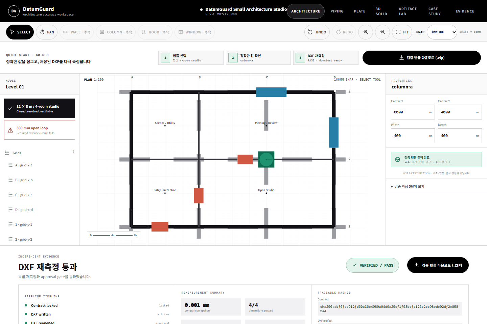
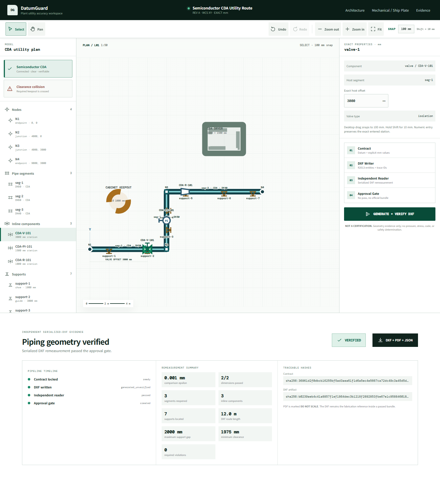
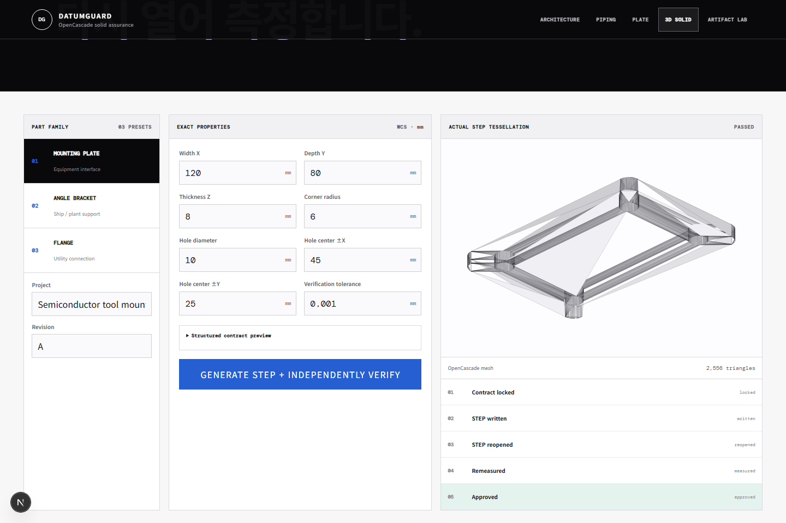
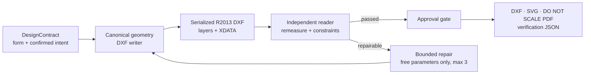

# DatumGuard

[](https://github.com/tjwnsdhfz/datumguard/actions/workflows/ci.yml)
[](https://github.com/tjwnsdhfz/datumguard/actions/workflows/deployment-smoke.yml)
[](https://datumguard-tjwnsdhfz.vercel.app)
[](https://datumguard-api.onrender.com/api/v1/health)
[](https://render.com/deploy?repo=https%3A%2F%2Fgithub.com%2Ftjwnsdhfz%2Fdatumguard)
[](https://vercel.com/new/clone?repository-url=https%3A%2F%2Fgithub.com%2Ftjwnsdhfz%2Fdatumguard&root-directory=web&env=NEXT_PUBLIC_DATUMGUARD_API_URL,NEXT_PUBLIC_GITHUB_URL)

DatumGuard는 건축 평면, 플랜트·반도체 utility piping, 기계·조선 plate와 3D solid를 구조화 contract로 정의하고, 실제 DXF·STEP·IFC를 독립적으로 다시 읽어 수치와 제약 evidence를 만드는 오픈소스 Engineering Design Assurance 도구입니다.

> **중요:** DatumGuard MVP는 구조·안전·법규·산업표준 적합성을 판정하지 않습니다. PDF 미리보기는 `DO NOT SCALE`이며, 검증된 bundle의 DXF가 제작 기준 파일입니다.

[](https://datumguard-tjwnsdhfz.vercel.app)

[공개 Architecture 데모 열기 →](https://datumguard-tjwnsdhfz.vercel.app) · [실행·재현 가이드 보기 →](docs/demo.md)

이미지의 재현 절차와 화면 계약은 [Architecture Demo Guide](docs/demo.md)에 고정되어 있습니다. Contract 기반 네 설계 모드는 실제 serialized DXF 또는 STEP evidence가 통과해야만 bundle을 활성화하며, `/intake`는 외부 CAD 산출물을 원본 그대로 감사합니다.

## Engineering domains

| 분야 | Route | 검증 예시 |
|---|---|---|
| Architecture | `/` | wall 폐합·연결, opening, grid/column, room area |
| Plant / Semiconductor Piping | `/piping` | route 연결·직교성, valve/support 위치, equipment clearance |
| Mechanical / Ship Plate | `/plate` | hole/slot/cutout, edge distance, ligament, overlap |
| 3D Solid Part | `/solid` | OpenCascade B-rep, bbox, topology, hole/bore diameter와 axis |
| Existing CAD Artifact | `/intake` | DXF·STEP·IFC 구조 감사와 revision compare |

세부 범위와 분야별 비목표는 [Engineering Domains](docs/engineering-domains.md)에 정리되어 있습니다.

### Plant / Semiconductor Piping demo



재현 절차와 브라우저 계약은 [Piping Demo Guide](docs/piping-demo.md)에 고정되어 있습니다.

### 3D STEP solid demo

[](https://datumguard-tjwnsdhfz.vercel.app/solid)

Mounting plate, angle bracket, flange를 생성하며 상세 contract·측정·Rhino 8 왕복 검증은 [3D Solid STEP Assurance](docs/solid-step.md)에 기록되어 있습니다. 외부 CAD 파일은 [Artifact Lab Guide](docs/artifact-lab.md)의 `/intake`에서 검사합니다.

## Assurance pipeline



Writer의 메모리 형상은 verifier로 전달되지 않습니다. Verifier는 직렬화된 DXF를 별도로 다시 읽고, 실제 측정값이 계약의 target·tolerance·constraint를 통과했을 때만 공식 bundle을 승인합니다.

## 핵심 원칙

- 폼 입력을 `DesignContract`의 source of truth로 사용합니다.
- DXF writer와 verifier는 분리되어 있으며 verifier는 직렬화된 DXF를 재측정합니다.
- `locked` 치수와 datum은 자동수정하지 않습니다.
- 공차·필수 제약을 모두 통과한 경우에만 공식 ZIP bundle을 만듭니다.
- Rhino 결과는 선택적 secondary evidence일 뿐 공식 판정을 대체하지 않습니다.

## 빠른 시작

요구 사항은 Python 3.12+와 Node.js 20+입니다.

```bash
python -m venv .venv
# Windows: .venv\Scripts\activate
# macOS/Linux: source .venv/bin/activate
pip install -e ".[dev]"
datumguard-api
```

다른 터미널에서 웹을 실행합니다.

```bash
cd web
npm ci
npm run dev
```

브라우저에서 다음 경로를 엽니다.

- `http://localhost:3000/`: Interactive Architecture demo
- `http://localhost:3000/piping`: Plant/Semiconductor Utility Piping demo
- `http://localhost:3000/plate`: 샘플 플레이트 설계·검증
- `http://localhost:3000/solid`: 3D solid STEP 생성·독립 재입력
- `http://localhost:3000/intake`: 외부 DXF·STEP·IFC 감사·revision 비교
- `http://localhost:8000/docs`: FastAPI 문서

## Docker 실행

```bash
docker compose up --build
```

- Web: `http://localhost:3000`
- API: `http://localhost:8000`
- Health: `http://localhost:8000/api/v1/health`
- Readiness: `http://localhost:8000/api/v1/ready`

## 공개 배포

현재 공개 배포는 아래 주소에서 바로 사용할 수 있습니다.

- Web: [datumguard-tjwnsdhfz.vercel.app](https://datumguard-tjwnsdhfz.vercel.app)
- Architecture: [web root](https://datumguard-tjwnsdhfz.vercel.app)
- Plant / Semiconductor Piping: [/piping](https://datumguard-tjwnsdhfz.vercel.app/piping)
- Mechanical / Ship Plate: [/plate](https://datumguard-tjwnsdhfz.vercel.app/plate)
- 3D Solid STEP UI: [/solid](https://datumguard-tjwnsdhfz.vercel.app/solid) — local/CI 기능이며 현재 Render Free API에서는 메모리 안전을 위해 비활성
- CAD Artifact Lab: [/intake](https://datumguard-tjwnsdhfz.vercel.app/intake)
- API: [health](https://datumguard-api.onrender.com/api/v1/health) · [domains](https://datumguard-api.onrender.com/api/v1/domains) · [OpenAPI](https://datumguard-api.onrender.com/docs)

2026-07-11 실환경 smoke test에서 세 mode의 생성→serialized DXF 재측정→approval bundle이 모두 통과했습니다. Architecture는 96m²와 4개 room seed, Piping은 12.0m route와 1,975mm minimum clearance, Plate는 전체 치수 편차 0.000000mm를 보고했습니다.

직접 복제해 배포하려면 공개 저장소 [tjwnsdhfz/datumguard](https://github.com/tjwnsdhfz/datumguard)를 사용합니다. 먼저 Render 버튼으로 backend를 만들고 발급된 API origin을 Vercel 배포 화면의 `NEXT_PUBLIC_DATUMGUARD_API_URL`에 입력합니다.

- Backend는 루트 `Dockerfile`을 Render, Fly.io, Railway 같은 컨테이너 서비스에 배포합니다.
- Frontend는 Vercel 프로젝트의 Root Directory를 `web/`으로 지정하고, build 전에 `NEXT_PUBLIC_DATUMGUARD_API_URL`을 backend URL로 설정합니다.
- Backend의 `DATUMGUARD_CORS_ORIGINS`에는 frontend origin을 쉼표로 구분해 설정합니다.

`render.yaml`은 GitHub CI check가 통과한 commit만 backend에 자동 배포하도록 구성되어 있습니다. Vercel for GitHub는 Root Directory `web/`에서 PR Preview와 `main` Production을 만들며, `deployment-smoke`가 다섯 workspace의 실제 DOM, API version/capability, architecture와 활성화된 optional canary, CORS를 확인합니다. 정확한 연결 계약은 [GitHub Deployment Guide](docs/github-deployment.md), 환경변수·cold start 순서는 [Deployment Guide](docs/deployment.md)를 따릅니다.

배포가 끝나면 `$WEB_ORIGIN/`, `/piping`, `/plate`, `/solid`, `/intake`를 모두 확인합니다. Frontend를 build한 뒤 `NEXT_PUBLIC_DATUMGUARD_API_URL`을 바꾸었다면 반드시 rebuild해야 합니다.

공개 데모는 stateless입니다. 계정·DB·서버 프로젝트 저장을 사용하지 않으며, 요청 파일과 자연어 원문을 영구 저장하지 않습니다. Hosted demo에는 Rhino 연결을 요구하지 않으며, Rhino evidence는 로컬 adapter가 있을 때만 secondary cross-check로 사용합니다.

운영 경계도 코드로 고정했습니다. 실제 수신 byte 제한, 파일별·합계 upload 제한, optional API key, anonymous/authenticated quota, heavy CAD queue, parser subprocess, request ID·redacted JSON log, `/live`·`/ready`·bounded `/metrics`, Solid/Artifact Lab kill switch를 제공합니다. 브라우저 draft는 30일 TTL의 IndexedDB에만 저장되며 [/privacy](https://datumguard-tjwnsdhfz.vercel.app/privacy)에서 전체 삭제할 수 있습니다. 10k DAU는 현재 Free 배포의 용량 주장이 아니며, 출시 체크리스트·장애/rollback·SLO·비용 후보는 [Operations Guide](docs/operations/README.md)와 [Cost Guard](docs/operations/cost-guard.md)에 분리했습니다.

OpenCascade Solid은 코드·Linux CI·Docker image에서 실제 STEP 생성과 재입력을 통과하지만, Render Free 512MB Production canary에서 HTTP 502가 발생해 `DATUMGUARD_ENABLE_SOLID=false`로 fail-closed했습니다. OOM 또는 worker restart는 의심되지만 직접 확인되지 않았습니다. 유료 변경 없이 기능을 과장하지 않기 위한 운영 결정이며, [Cost Guard](docs/operations/cost-guard.md)의 Render Standard 이상 staging에서 canary와 부하 검증을 통과한 뒤에만 다시 활성화합니다.

## API와 MCP

- 한 번에 생성·검증: `POST /api/v1/designs/run`
- 계약 검증: `POST /api/v1/contracts/validate`
- 건축 평면 생성·검증: `POST /api/v1/architecture/designs/run`
- 건축 계약 검증: `POST /api/v1/architecture/contracts/validate`
- 배관 route 생성·검증: `POST /api/v1/piping/designs/run`
- 배관 계약 검증: `POST /api/v1/piping/contracts/validate`
- 3D solid 생성·STEP 독립 검증: `POST /api/v1/solid/designs/run`
- CAD 파일 감사: `POST /api/v1/artifacts/audit`
- CAD revision 비교: `POST /api/v1/artifacts/compare`
- Liveness/readiness/metrics: `GET /api/v1/live`, `GET /api/v1/ready`, `GET /api/v1/metrics`
- 단계별 endpoint는 [TRD](docs/TRD.md)에 정리되어 있습니다.
- 로컬 MCP: `datumguard-mcp`

MCP는 기존 9개 설계 도구에 `artifact_audit`, `artifact_compare`, `solid_generate_verify`를 더한 12개 도구를 제공합니다.

MCP contract 분기는 입력의 `design_kind`로 결정합니다.

| `design_kind` | MCP application service | Web route |
|---|---|---|
| `architectural_plan` | Architecture | `/` |
| `piping_plan` | Piping | `/piping` |
| `solid_part` | OpenCascade STEP | `/solid` |
| 필드 없음 | Plate/panel 호환 경로 | `/plate` |

기존 9개 도구 이름은 plate·architecture·piping에서 하위 호환됩니다. `artifact_audit`과 `artifact_compare`는 contract 없는 실제 파일에 informational evidence만 만들고, `solid_generate_verify`는 `solid_part` contract를 실제 STEP으로 직렬화한 뒤 별도 OpenCascade worker에서 재측정합니다. `rhino_preview`는 secondary evidence이며 공식 판정을 변경하지 않습니다.

## 검증

```powershell
$env:UV_LINK_MODE = "copy" # Windows OneDrive only
uv sync --frozen --extra dev
uv run --frozen ruff check src tests tools
uv run --frozen mypy src/datumguard
uv run --frozen pytest
Set-Location web
npm run typecheck
npm run lint
npm run build
```

Architecture, Piping, Plate, Solid, Artifact Lab route의 브라우저 계약은 실제 FastAPI를 함께 시작하는 Playwright E2E로 검사합니다.

```powershell
Set-Location web
npm run test:e2e
```

합성 예제 계약은 Architecture의 [통과 4-room studio](fixtures/examples/architecture_four_room.json)·[300mm open-loop 실패](fixtures/examples/architecture_open_300mm.json), Piping의 [통과 CDA route](fixtures/examples/piping_utility.json)·[clearance 실패](fixtures/examples/piping_clearance_failure.json)로 제공합니다. 기존 Architecture fixture도 하위 호환 회귀용으로 유지합니다. 모든 예제는 실사업장 도면이 아닌 공개 합성 데이터입니다.

## 문서

- [PRD](docs/PRD.md)
- [TRD](docs/TRD.md)
- [Prompt Design](docs/prompt-design.md)
- [Architecture Demo Guide](docs/demo.md)
- [Piping Demo Guide](docs/piping-demo.md)
- [3D Solid STEP Assurance](docs/solid-step.md)
- [Artifact Lab Guide](docs/artifact-lab.md)
- [Engineering Domains](docs/engineering-domains.md)
- [Mission Control Design System](docs/design-system.md)
- [Deployment Guide](docs/deployment.md)
- [GitHub Deployment Guide](docs/github-deployment.md)
- [현재 구현·배포 Handoff](docs/HANDOFF.md)
- [개발 프롬프트 실행 순서](prompts/INDEX.md)

## License

MIT
