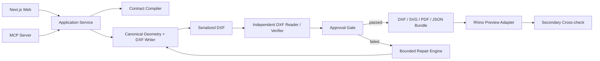

# DatumGuard 기술 요구사항 정의서(TRD)

| 항목 | 내용 |
|---|---|
| 문서 버전 | 1.0.0 |
| 작성일 | 2026-07-12 |
| 제품 요구사항 | [PRD.md](./PRD.md) |
| Prompt 계약 | [prompt-design.md](./prompt-design.md) |
| 내부 단위·평면 | millimeter, WCS XY |
| 공식 제작 artifact | 검증된 DXF |

## 1. 기술 목표

DatumGuard는 LLM 또는 폼 입력을 `DesignContract`로 확정하고, canonical geometry를 DXF로 직렬화한 뒤 별도 reader/verifier가 해당 DXF를 다시 측정하여 통과 여부를 결정한다. 생성 프로세스의 성공 여부, LLM 주장 또는 Rhino 화면은 공식 승인 근거가 될 수 없다.

핵심 불변조건은 다음과 같다.

1. 숫자·단위·datum이 모호하면 실행하지 않는다.
2. `locked=true`인 dimension과 datum은 어떤 repair도 변경할 수 없다.
3. writer의 메모리 객체를 verifier 입력으로 재사용하지 않는다.
4. 공식 export는 `verification.status == "passed"`일 때만 생성한다.
5. 같은 canonical contract와 code/profile version은 같은 geometry hash를 만든다.
6. Rhino는 secondary evidence이며 공식 verifier를 대체하지 않는다.

## 2. 범위

### 포함

- Rectangle 또는 closed polygon plate outline
- Circular hole, slot, rectangular cutout
- Linear/circular feature pattern
- Datum 기반 치수와 공차
- Symmetry, alignment, equal spacing, non-overlap, minimum edge distance/ligament
- DXF, SVG, `DO NOT SCALE` PDF, verification JSON
- Stateless FastAPI와 로컬 MCP 서버
- SVG 웹 미리보기와 IndexedDB draft
- Rhino 미리보기·교차검증

### 제외

- 3D 공식 검증, 구조·열·유체 해석
- 산업표준 자동 인증
- 임의 CAD/Rhino script 실행
- 계정·DB·협업·서버 장기저장
- 자유곡선과 불규칙 spline의 공식 검증

## 3. 시스템 아키텍처



### 런타임

| 런타임 | 기술 | 책임 |
|---|---|---|
| Core | Python 3.12, Pydantic v2 | 계약·상태·오류·hash |
| Geometry | Shapely | 2D 형상, 교차, 거리, containment |
| DXF | ezdxf | writer와 별도 reader |
| Repair | OR-Tools CP-SAT | 0.001mm 정수 스케일 제한 수정 |
| API | FastAPI | Stateless HTTP API |
| MCP | MCP Python SDK | 로컬 tool surface와 artifact workspace |
| Web | Next.js, TypeScript | 폼, 자연어 보조, SVG, IndexedDB |
| Rhino | 기존 RhinoMCP adapter | 미리보기와 `analyze_objects` evidence |

## 4. 모듈 경계

```text
datumguard/
├─ apps/
│  ├─ api/
│  ├─ mcp/
│  └─ web/
├─ packages/
│  ├─ contracts/
│  ├─ compiler/
│  ├─ geometry/
│  ├─ dxf_writer/
│  ├─ dxf_verifier/
│  ├─ repair/
│  ├─ exporters/
│  └─ rhino_adapter/
├─ fixtures/
│  ├─ golden_contracts/
│  └─ language_cases/
├─ docs/
└─ prompts/
```

`dxf_writer`는 `dxf_verifier`를 import할 수 없고 반대 방향도 금지한다. 두 모듈은 `contracts`의 공개 타입과 실제 DXF byte/file만 공유한다.

## 5. 공개 `DesignContract`

### 5.1 식별자와 canonicalization

- 모든 entity는 stable string ID를 가진다.
- 입력 단위는 `mm` 또는 `inch`이고 compiler가 mm로 변환한다.
- canonical JSON은 key 정렬, 명시적 null 제거, float decimal 정규화를 적용한다.
- `contract_hash = SHA-256(canonical_contract_without_hash + schema_version)`이다.
- 좌표는 WCS XY이며 datum origin과 axis를 명시한다.

### 5.2 필드 계약

| 필드 | 타입 | 규칙 |
|---|---|---|
| `schema_version` | string | MVP `1.0.0` |
| `units` | enum | `mm`, `inch` |
| `datum` | object | origin, x_axis, y_axis, plane=`XY`, locked=true |
| `outline` | object | rectangle 또는 closed polygon |
| `features` | array | hole/slot/rectangular_cutout/pattern |
| `dimensions` | array | target, lower/upper tolerance, locked, source |
| `constraints` | array | type, entity_ids, parameters, required |
| `free_parameters` | array | path, min, max, step, unit |
| `manufacturing_profile` | object | process, kerf, tool/minimum feature |
| `metadata` | object | project_name, revision, notes |
| `contract_hash` | string/null | compiler가 채움 |

### 5.3 유효한 예시

아래 블록은 `fixtures/examples/design_contract.json`의 기준 내용으로 사용한다.

```json
{
  "schema_version": "1.0.0",
  "units": "mm",
  "datum": {
    "id": "datum-main",
    "origin": [0.0, 0.0],
    "x_axis": [1.0, 0.0],
    "y_axis": [0.0, 1.0],
    "plane": "XY",
    "locked": true
  },
  "outline": {
    "id": "outline-plate",
    "type": "rectangle",
    "origin": [0.0, 0.0],
    "width": 120.0,
    "height": 80.0
  },
  "features": [
    {
      "id": "hole-1",
      "type": "circular_hole",
      "center": [10.0, 10.0],
      "diameter": 6.0
    },
    {
      "id": "slot-1",
      "type": "slot",
      "center": [60.0, 40.0],
      "length": 24.0,
      "width": 8.0,
      "angle_deg": 0.0
    },
    {
      "id": "cutout-1",
      "type": "rectangular_cutout",
      "origin": [90.0, 30.0],
      "width": 15.0,
      "height": 20.0,
      "corner_radius": 0.0
    },
    {
      "id": "pattern-1",
      "type": "linear_pattern",
      "source_feature_id": "hole-1",
      "count": 4,
      "direction": [1.0, 0.0],
      "spacing": 30.0
    }
  ],
  "dimensions": [
    {
      "id": "dim-width",
      "path": "outline.width",
      "target": 120.0,
      "tolerance_lower": -0.1,
      "tolerance_upper": 0.1,
      "locked": true,
      "source": {"kind": "form", "ref": "plate-width"}
    },
    {
      "id": "dim-slot-x",
      "path": "features.slot-1.center.0",
      "target": 60.0,
      "tolerance_lower": -0.2,
      "tolerance_upper": 0.2,
      "locked": false,
      "source": {"kind": "form", "ref": "slot-center-x"}
    }
  ],
  "constraints": [
    {
      "id": "constraint-containment",
      "type": "features_inside_outline",
      "entity_ids": ["outline-plate", "hole-1", "slot-1", "cutout-1"],
      "parameters": {"minimum_edge_distance": 2.0},
      "required": true
    },
    {
      "id": "constraint-non-overlap",
      "type": "non_overlap",
      "entity_ids": ["hole-1", "slot-1", "cutout-1"],
      "parameters": {"minimum_ligament": 1.5},
      "required": true
    }
  ],
  "free_parameters": [
    {
      "id": "free-slot-x",
      "path": "features.slot-1.center.0",
      "minimum": 55.0,
      "maximum": 65.0,
      "step": 0.001,
      "unit": "mm"
    }
  ],
  "manufacturing_profile": {
    "id": "profile-custom-1",
    "process": "custom",
    "kerf": 0.2,
    "tool_diameter": null,
    "minimum_feature": 1.0,
    "minimum_ligament": 1.5,
    "confirmed_by_user": true
  },
  "metadata": {
    "project_name": "Sample Mounting Plate",
    "revision": "A",
    "notes": "Public synthetic fixture"
  },
  "contract_hash": null
}
```

### 5.4 Contract 상태

| 상태 | 의미 | 생성 | 공식 export |
|---|---|---:|---:|
| `draft` | 입력 중 | 아니오 | 아니오 |
| `needs_confirmation` | 수치·단위·datum 확인 필요 | 아니오 | 아니오 |
| `under_constrained` | 자유도가 남음 | preview만 | 아니오 |
| `ready` | 생성 가능 | 예 | 검증 후 |
| `infeasible` | required/locked 조건 충돌 | 아니오 | 아니오 |

## 6. Requirements Compiler

Compiler 입력은 구조화 폼 값과 선택적 `intent_text`다. LLM은 prompt-design의 스키마에 따라 다음만 제안한다.

- 명시된 constraint 후보
- feature와 form field의 연결
- 추가 확인 질문
- 원문 evidence span

Compiler는 다음을 결정론적으로 수행한다.

- inch→mm 변환
- ID 유일성
- datum 직교·단위벡터 검사
- dimension path 존재 검사
- locked/free path 충돌 검사
- outline 폐합·self-intersection 검사
- pattern expansion 가능성 검사
- required field 완전성

LLM 출력에 근거 없는 숫자나 contract에 없는 ID가 있으면 `DG_PROMPT_OUTPUT_INVALID`로 거부한다.

## 7. Canonical Geometry

### 형상 규칙

- Rectangle은 origin을 lower-left corner로 해석한다.
- Polygon은 반시계 방향 exterior ring과 반복되지 않는 마지막 점을 사용한다.
- Hole은 center와 diameter로 표현한다.
- Slot은 centerline length, width, angle로 표현하고 양끝 반원의 반지름은 `width/2`다.
- Rectangular cutout은 origin lower-left, width/height, optional corner radius를 사용한다.
- Pattern은 source feature를 복제하며 source 자체를 count에 포함한다.

### 수치 정책

- 내부 계산은 Python double을 사용한다.
- 비교 epsilon은 `0.001mm`다.
- CP-SAT repair는 모든 mm 값을 1000배 하여 integer micrometer grid로 변환한다.
- Hash 생성 시 값은 0.001mm grid로 정규화한다.

## 8. DXF Writer

### DXF 계약

- DXF version은 `R2013`으로 고정한다.
- 모델 공간 단위는 millimeter다.
- 레이어는 `OUTLINE`, `CUT`, `CENTER`, `DIM`, `CONSTRUCTION`, `META`다.
- Outline과 실제 절단 feature는 closed `LWPOLYLINE`, `CIRCLE`, `ARC` 조합으로 기록한다.
- 각 entity는 `DATUMGUARD` app ID XDATA에 `contract_hash`, `feature_id`, `feature_type`, `revision`을 기록한다.
- Dimension은 참조용이며 verifier는 dimension text를 측정값으로 신뢰하지 않는다.

Writer 결과는 `generated_unverified`이며 approval token이 없다.

## 9. Independent DXF Verifier

Verifier는 DXF bytes/path만 입력받고 다음 순서로 동작한다.

1. DXF 구조·version·units·required layers 검사
2. XDATA에서 contract/feature ID 수집
3. Entity를 독립 geometry로 재구성
4. Bounding box, feature center/size, pattern spacing 재측정
5. Outline containment, overlap, edge distance, ligament 검사
6. Dimension target과 실제값 비교
7. Artifact hash와 verification JSON 생성

### 측정 결과

```json
{
  "measurement_id": "measurement-dim-width",
  "dimension_id": "dim-width",
  "target": 120.0,
  "actual": 120.0,
  "deviation": 0.0,
  "tolerance_lower": -0.1,
  "tolerance_upper": 0.1,
  "unit": "mm",
  "passed": true,
  "evidence": {
    "artifact": "drawing.dxf",
    "entities": ["outline-plate"],
    "method": "dxf_geometry_remeasurement"
  }
}
```

### Verification 상태

- `passed`
- `failed_verification`
- `repairable`
- `repair_exhausted`
- `cross_kernel_mismatch`

`passed`는 required violation이 0이고 모든 locked dimension이 허용범위에 있을 때만 가능하다.

## 10. Repair Engine

- Repair 입력은 contract, violations, 현재 iteration이다.
- 후보 path는 `free_parameters`에 있는 path만 허용한다.
- 목적함수는 violation 제거, 원래값과 변경 거리 최소화, 변경 파라미터 수 최소화 순이다.
- Locked path, datum, outline topology, feature count 삭제는 불변이다.
- Iteration은 1~3이며 3회 후 실패하면 `repair_exhausted`다.
- 모든 수정은 before/after, constraint ID, reason, solver status를 기록한다.
- Solver가 해를 찾지 못하면 값을 임의 완화하지 않고 `infeasible`을 반환한다.

## 11. Approval과 Export

Approval service는 다음이 모두 참일 때만 `approval_token`을 만든다.

- Contract hash가 생성 시점과 동일
- Artifact hash가 verifier 입력과 동일
- Verification status가 `passed`
- Required violation 0개
- Repair history가 locked 값을 변경하지 않음
- Rhino cross-check가 요청된 경우 mismatch 없음

Bundle 구성:

```text
datumguard-{contract_hash-prefix}/
├─ drawing.dxf
├─ preview.svg
├─ drawing-do-not-scale.pdf
├─ design-contract.json
├─ verification.json
├─ repair-history.json
└─ manifest.json
```

SVG·PDF·JSON의 feature ID는 DXF XDATA와 일치해야 한다. PDF에는 `DO NOT SCALE`, 단위, datum, revision, contract/artifact hash를 표시한다.

## 12. 공개 응답 Envelope

```json
{
  "status": "passed",
  "contract_hash": "sha256:contract-example",
  "artifact_hash": "sha256:artifact-example",
  "measurements": [],
  "violations": [],
  "evidence": [],
  "error": null
}
```

모든 API/MCP 응답은 위 필드를 갖는다. 실패 시 `status`는 실패 상태이고 `error`는 `{code, message, details, correlation_id}`다.

### 오류코드

| Code | 의미 |
|---|---|
| `DG_INPUT_INVALID` | JSON/폼 타입 오류 |
| `DG_UNIT_AMBIGUOUS` | 단위 확인 필요 |
| `DG_DATUM_MISSING` | datum 누락 |
| `DG_NEEDS_CONFIRMATION` | 자연어 모호성 |
| `DG_CONTRACT_UNDER_CONSTRAINED` | 공식 생성 불가 |
| `DG_CONTRACT_INFEASIBLE` | locked/required 충돌 |
| `DG_GEOMETRY_INVALID` | outline/feature 형상 오류 |
| `DG_DXF_WRITE_FAILED` | DXF 생성 실패 |
| `DG_DXF_READ_FAILED` | 독립 재읽기 실패 |
| `DG_VERIFICATION_FAILED` | 공차/제약 실패 |
| `DG_REPAIR_EXHAUSTED` | 3회 수정 실패 |
| `DG_EXPORT_NOT_APPROVED` | approval 없는 export |
| `DG_CROSS_KERNEL_MISMATCH` | Rhino 교차측정 불일치 |
| `DG_PROMPT_OUTPUT_INVALID` | LLM structured output 오류 |

## 13. MCP 도구

| 도구 | 핵심 입력 | 결과/상태 |
|---|---|---|
| `design_contract_draft` | form_values, intent_text | draft/needs_confirmation |
| `design_contract_validate` | contract | under_constrained/ready/infeasible |
| `drawing_generate` | ready contract | generated_unverified |
| `drawing_verify` | contract, artifact ref | passed/repairable/failed |
| `repair_propose` | contract, violations | bounded proposal |
| `repair_apply` | contract, accepted proposal | new revision |
| `drawing_compare` | baseline, candidate | dimension/feature/constraint diff |
| `export_bundle` | passed verification | local bundle path |
| `rhino_preview` | verified artifact | secondary evidence/mismatch |
| `artifact_audit` | DXF/STEP/IFC bytes | immutable informational audit |
| `artifact_compare` | baseline/candidate artifacts | revision evidence |
| `solid_generate_verify` | limited solid contract | STEP round-trip evidence |
| `frame_analyze` | structural frame contract | deterministic screening evidence |
| `frame_repair_propose` | structural frame contract | bounded section proposal |
| `frame_rhino_adapt` | Rhino/GH exchange | normalized mm contract/confirmation |
| `frame_dxf_generate_verify` | structural frame contract | exact solve + reopened DXF gate |
| `frame_surrogate_predict` | structural frame contract | PREDICTED/REVIEW_REQUIRED only |
| `frame_opensees_parity_evidence` | 없음 | packaged 6-case parity evidence |

MCP 로컬 artifact는 사용자가 지정한 workspace 아래 `.datumguard/runs/{contract_hash}/`에 저장한다. 입력 경로 밖 쓰기와 임의 명령 실행을 허용하지 않는다.
현재 public MCP surface는 기존 9개 contract 도구와 위 확장 9개를 합한 18개다.

## 14. HTTP API

Base path는 `/api/v1`이다.

| Method | Path | 동작 |
|---|---|---|
| POST | `/contracts/draft` | 폼+자연어 초안 |
| POST | `/contracts/validate` | 계약 상태 검사 |
| POST | `/drawings/generate` | DXF 생성 |
| POST | `/drawings/verify` | 독립 검증 |
| POST | `/repairs/propose` | 수정안 |
| POST | `/repairs/apply` | 새 contract revision |
| POST | `/drawings/compare` | 버전 비교 |
| POST | `/exports` | 승인 bundle 다운로드 |
| POST | `/rhino/preview` | 로컬 adapter 요청; 공개 서버는 비활성 |
| GET | `/schema/frame-contract` | `StructuralFrameContract` schema |
| GET | `/schema/rhino-frame-exchange` | `RhinoFrameExchange` schema |
| POST | `/frame/contracts/validate` | frame contract validation/hash |
| POST | `/frame/designs/run` | 공식 deterministic 2D screening |
| POST | `/frame/rhino/adapt` | 명시적 unit/datum exchange 정규화 |
| POST | `/frame/cad/run` | solver + R2013 DXF re-open assurance |
| POST | `/frame/surrogate/predict` | 비공식 portable GraphSAGE triage |
| GET | `/frame/benchmarks/opensees` | packaged genuine OpenSeesPy evidence |
| GET | `/frame/benchmarks/gnn` | packaged PyG topology-holdout evidence |

API는 stateless이며 요청 본문 또는 같은 요청에서 발급한 짧은 수명의 signed payload로 상태를 전달한다. MVP 공개 서버는 사용자 파일과 prompt 원문을 영구 저장하지 않는다.

## 15. 웹 클라이언트

- Datum/단위/제작 프로파일 → outline → feature → dimensions/constraints 순서의 wizard
- 폼이 contract의 source of truth이며 자연어 결과는 diff로 제안
- SVG preview는 canonical geometry를 표시하지만 approval을 의미하지 않음
- IndexedDB에는 draft contract와 UI 설정만 저장
- Pass/fail 화면은 target, actual, deviation, tolerance, evidence를 표로 제공
- 실패 시 locked/free 여부와 허용 가능한 repair만 표시
- Export 버튼은 approval token이 없으면 disabled이며 API도 재검증한다.

### 15.1 Architecture accuracy workspace

`ArchitecturalPlanContract`는 `design_kind: "architectural_plan"` discriminator와 다음 collection을 가진다.

- `grids`: id, label, start/end, axis, normalized offset, locked
- `walls`: start/end, thickness, wall type, locked
- `openings`: host `wall_id`, offset, width, height, sill height, swing
- `columns`: rectangular/circular geometry와 center
- `room_seeds`: name, point, optional expected area
- `dimensions`, `constraints`, `free_parameters`, `drawing_profile`, `metadata`

건축 writer는 `A-GRID`, `A-WALL`, `A-WALL-CENTER`, `A-DOOR`, `A-WIND`, `A-COLS`, `A-ROOM`, `A-DIMS`, `A-ANNO`, `DG-META` layer와 `DATUMGUARD` XDATA를 사용한다. 모든 entity XDATA에는 `contract_hash`, `entity_id`, `entity_type`, `revision`을 기록한다. Verifier는 writer의 Shapely 객체를 전달받지 않고 R2013 DXF byte를 다시 읽어 다음을 판정한다.

1. layer, units, contract hash와 entity XDATA
2. wall centerline의 exterior 폐합과 전체 연결성
3. opening의 host wall 포함·중복
4. column-grid 정렬과 column/opening clearance
5. room seed의 단일 폐합 영역 해석
6. dimension target/tolerance와 duplicate geometry

건축 primary violation code는 `DG_ARCH_EXTERIOR_OPEN`, `DG_ARCH_WALL_DISCONNECTED`, `DG_ARCH_OPENING_OUTSIDE_HOST`, `DG_ARCH_OPENING_OVERLAP`, `DG_ARCH_COLUMN_OFF_GRID`, `DG_ARCH_ROOM_UNRESOLVED`, `DG_ARCH_DUPLICATE_GEOMETRY`로 고정한다. Writer와 별개인 reader는 0.001mm 비교 격자에서 이를 판정한다.

`POST /api/v1/architecture/contracts/validate`는 정규화 계약을, `POST /api/v1/architecture/designs/run`은 preview, timeline, summary와 approval-gated bundle을 반환한다. `GET /api/v1/schema/architectural-plan-contract`와 `/api/v1/architecture/schema`는 동일 JSON Schema를 제공한다.

웹 기본 route `/`는 object tree/native SVG canvas/property inspector의 3-pane layout이다. Desktop은 pointer drag와 100mm snap(Shift 10mm), undo/redo 50단계, pan/zoom/Fit을 제공한다. 900px 미만에서는 drag를 비활성화하지만 exact numeric edit와 검증은 유지한다. Health endpoint는 최대 70초 polling하며 준비 중 상태와 수동 retry를 제공한다. `/plate`는 기존 plate workspace다. 분야별 draft는 서로 다른 IndexedDB key를 사용한다.

MCP의 9개 공개 도구명은 바꾸지 않는다. 입력에 `design_kind`가 있으면 architecture application service로 분기하며 validate/generate/verify/repair/compare/export가 동일 envelope을 반환한다. Architecture repair proposal과 apply는 선언된 `columns.<id>.center.0|1` 및 `openings.<id>.offset`만 허용하고, CP-SAT micrometer integer grid에서 min/max/step을 지키며 최대 3회로 제한한다. Wall topology와 locked path는 어떤 proposal에서도 적용하지 않는다.

### 15.2 Plant / semiconductor piping workspace

`PipingPlanContract`는 `design_kind: "piping_plan"`과 node, pipe segment, inline component, support, equipment/keepout zone, dimension, constraint, drawing profile, metadata를 가진다. 모든 route geometry는 WCS XY에서 mm로 정규화하고 segment endpoint는 node ID로 연결한다.

Piping DXF는 `P-PIPE`, `P-NODE`, `P-COMP`, `P-SUPPORT`, `P-EQUIP`, `P-DIMS`, `P-META` layer와 `DATUMGUARD` XDATA를 사용한다. 독립 verifier는 serialized R2013 DXF만 입력으로 받아 다음을 재구성한다.

1. 각 pipe segment의 실제 endpoint, length, 방향과 nominal diameter metadata
2. route graph 연결성과 orthogonal segment 여부
3. node와 segment endpoint의 좌표 정렬
4. inline component와 support의 host segment projection/offset
5. segment endpoint를 포함한 최대 support gap
6. pipe centerline/외경과 equipment·keepout zone 사이 minimum clearance
7. dimension tolerance, duplicate geometry, unit/layer/XDATA/hash

`GET /api/v1/schema/piping-plan-contract`, `GET /api/v1/piping/schema`, `POST /api/v1/piping/contracts/validate`, `POST /api/v1/piping/designs/run`을 제공한다. 성공 summary의 길이·support gap·clearance는 contract memory가 아니라 독립 DXF reader의 geometry에서 계산하며 `summary_source`를 명시한다.

웹 `/piping`은 architecture와 같은 3-pane interaction model을 사용하되 object tree를 Nodes/Pipes/Components/Supports/Equipment로 구성한다. Desktop은 valve offset drag와 100mm snap(Shift 10mm), exact numeric inspector, undo/redo, pan/zoom/Fit을 제공한다. Mobile은 drag를 비활성화하고 수치 입력과 검증을 유지한다. IndexedDB key는 다른 분야와 분리한다.

MCP 공개 도구 수와 이름은 유지하고 `design_kind`로 plate/architecture/piping service를 결정적으로 분기한다. Piping repair가 지원되지 않는 경우 명시적 `DG_PIPE_REPAIR_NOT_SUPPORTED`를 반환한다.

## 16. Rhino Adapter

- Rhino adapter는 검증된 DXF만 import/preview한다.
- `analyze_objects`로 validity, bounding box, length/area를 얻는다.
- 공식 verifier 측정과 `max(0.001mm, dimension tolerance)` 이상 차이나면 `DG_CROSS_KERNEL_MISMATCH`다.
- Rhino 결과는 `secondary=true` evidence로 저장한다.
- Rhino가 없거나 연결 실패해도 core generate/verify는 동작한다.
- 임의 RhinoScript/C# tool은 adapter allowlist에 포함하지 않는다.

## 17. Prompt/LLM 경계

- LLM은 `ContractDraftResult`만 생성한다.
- Geometry, pass/fail, repair feasibility, hash와 approval은 결정론적 서비스가 생성한다.
- LLM tool allowlist는 contract 조회/초안/검증과 read-only evidence 조회로 제한한다.
- 공급자 장애는 `needs_confirmation` 또는 폼 전용 모드로 전환한다.
- Prompt version, model ID, schema version, input/output hash를 요청 응답에 기록하되 서버에 장기 저장하지 않는다.

## 18. 보안

- JSON body, 파일 크기, MIME/magic byte와 path를 검증한다.
- DXF parser에 외부 네트워크·임의 코드 경로가 없다.
- MCP workspace path traversal과 symlink escape를 차단한다.
- API key는 서버 secret으로만 주입하고 client bundle/로그에 포함하지 않는다.
- Prompt에는 필요한 form 값과 intent만 보내며 DXF bytes를 보내지 않는다.
- 공식 실행 경로에서 shell, RhinoScript, C# 실행을 금지한다.
- Export manifest에 dependency/profile/schema version을 기록한다.

## 19. 성능·관측성

기준 도면은 outline 1개, expanded feature 200개 이하, dimension/constraint 각 200개 이하다.

| 작업 | 목표 |
|---|---:|
| Contract validation p95 | 200ms 이하 |
| Canonical geometry + DXF p95 | 1초 이하 |
| Independent verification p95 | 2초 이하 |
| Repair 1회 p95 | 2초 이하 |
| Repair 없는 전체 p95 | 5초 이하 |

구조화 로그 필드: `correlation_id`, `contract_hash`, `artifact_hash`, `stage`, `status`, `duration_ms`, `violation_codes`, `repair_iteration`. 숫자·도면 원문과 사용자 자연어는 기본 로그에 남기지 않는다.

## 20. 테스트 전략

### Unit

- inch/mm 변환과 datum 직교성
- canonical JSON/hash
- feature expansion
- dimension path resolution
- locked/free conflict
- error envelope

### Property-based

- feature 입력 순서와 무관한 canonical hash
- mm↔inch round trip
- 같은 contract 반복 생성의 동일 artifact hash
- locked parameter가 모든 repair에서 불변
- 모든 unapproved artifact export 거부

### Golden geometry 100개

- 단순 plate, polygon, hole/slot/cutout, linear/circular patterns
- rotated slot, tolerance boundary, minimum edge/ligament
- overlap, outside outline, invalid polygon
- locked conflict, under-constrained contract
- writer DXF를 reader가 재구성하고 expected measurement와 비교

### Language 50개

- 명시적 숫자·단위
- 단위 누락, “적당히”, “가운데쯤”
- 서로 충돌하는 요구
- form 값과 다른 자연어 숫자
- 근거 없는 표준·공차 요청

### Integration/E2E

- Form→draft→ready→generate→verify→export
- Fail→repair proposal→revision→pass
- Repair 3회 exhaustion
- MCP와 HTTP envelope parity
- Rhino 연결 없음/측정 일치/불일치
- Bundle manifest와 feature ID 일치
- Architecture valid fixture의 DXF 재측정·bundle 승인
- Architecture open-loop fixture의 violation·export 차단
- `/` column drag/snap→실제 API verify→hash/timeline/download
- `/plate` deep-link 회귀
- Piping valid fixture의 route·support·clearance DXF 재측정과 bundle 승인
- Piping clearance failure fixture의 violation과 export 차단
- `/piping` valve drag/snap→실제 API verify→hash/timeline/download
- Architecture와 mechanical/ship plate route 회귀

## 21. 요구사항 추적표

| 요구사항 | 구현 영역 | 필수 검증 |
|---|---|---|
| DG-FR-001 | contracts/compiler | contract draft/schema tests |
| DG-FR-002 | compiler | ambiguity and confirmation tests |
| DG-FR-003 | contracts/compiler + architecture_core + piping_core | plate/architecture/piping unit/datum normalization tests |
| DG-FR-004 | geometry/contracts | feature/pattern golden tests |
| DG-FR-005 | contracts/repair + architecture_models + piping_models | dimension, constraint, locked/free tests |
| DG-FR-006 | compiler | state transition tests |
| DG-FR-007 | geometry + architecture_core + piping_core | deterministic geometry/hash tests |
| DG-FR-008 | dxf_writer + architecture_artifacts + piping_artifacts | layer, unit and XDATA tests |
| DG-FR-009 | dxf_verifier + architecture_verifier + piping_verifier | independent round-trip measurement tests |
| DG-FR-010 | approval + architecture_service + piping_service | tolerance and official export gate tests |
| DG-FR-011 | repair | locked property and max-3 tests |
| DG-FR-012 | exporters + architecture_artifacts + piping_artifacts | bundle/ID/hash/PDF tests |
| DG-FR-013 | web | Playwright plate + architecture + piping drag/snap/export tests |
| DG-FR-014 | API | plate/architecture/piping stateless repeatability tests |
| DG-FR-015 | MCP | 9-tool schema, three-domain design_kind dispatch, envelope parity tests |
| DG-FR-016 | rhino_adapter | absent/match/mismatch tests |
| DG-FR-017 | compare/audit + domain summaries | revision diff/hash/area/route summary tests |
| DG-FR-018 | evaluation | 100+50 benchmark run |
| DG-FR-019 | artifact_service + Artifact Lab | real DXF/STEP/IFC immutable audit tests |
| DG-FR-020 | artifact_service compare | DXF fingerprint, STEP metric, IFC GlobalId revision tests |
| DG-FR-021 | solid_models + `/solid` | Pydantic schema, three family and exact input tests |
| DG-FR-022 | solid_service + cad_worker | isolated OpenCascade STEP writer/re-import and pass-only bundle tests |
| DG-FR-023 | RhinoCode local smoke | STEP→headless RhinoDoc→3DM unit/bbox evidence |
| DG-FRAME-FR-001~010 | frame_models/solver/service + `/frame` | deterministic contract/solver/repair/API/MCP/UI tests |
| DG-FRAME-FR-011 | frame_rhino_adapter + integrations | unit/datum/metadata/order/merge-boundary tests |
| DG-FRAME-FR-012 | frame_dxf + frame_cad_service | R2013/mm/XDATA/tamper/re-open/download-gate tests |
| DG-FRAME-FR-013 | frame_opensees | genuine 3.8 six-case parity and fail-closed tests |
| DG-FRAME-FR-014 | frame_gnn + benchmark JSON | 90-case topology holdout, leakage and GraphSAGE/GAT tests |
| DG-FRAME-FR-015 | frame_surrogate | missing/corrupt/OOD/high-uncertainty REVIEW_REQUIRED tests |
| DG-FRAME-FR-016 | frame_cad_service + frame_surrogate | official solver separation and no-authoritative-AI tests |
| DG-FRAME-FR-017 | API + MCP | assurance schema/routes and 18-tool inventory tests |
| DG-FRAME-FR-018 | `/frame` + deployment smoke | DOM/domain/deterministic canary/release SHA/CORS gate |
| DG-NFR-001~010 | 전체 | CI, security, performance, compatibility suites |

## 22. 배포와 CI

- Backend/MCP는 하나의 Python package와 Docker image에서 build한다.
- Web은 정적 frontend와 stateless API URL로 구성한다.
- 현재 CI 순서: format/lint/type check → unit/property/API/MCP integration → web build/E2E → backend·web Docker build → SBOM → fixed-critical scan.
- 현재 release에는 source tag, schema·sample contract·MCP 설치법·공개 웹 URL과 backend/web CycloneDX SBOM을 포함한다. 100+50 benchmark report와 registry에 publish한 signed Docker image는 M8b 후속 release 목표이며 v0.3.0 완료 조건으로 주장하지 않는다.

## 23. 구현 순서

1. Repository·contract·error foundation
2. Canonical geometry와 DXF writer
3. Independent verifier와 approval gate
4. Repair engine과 revision history
5. Web experience
6. FastAPI와 MCP
7. Rhino adapter
8. QA·benchmark·release
9. FrameGuard deterministic structural screening
10. FrameGuard Rhino/GH exchange와 independent DXF gate
11. OpenSeesPy/PyG research validation, uncertainty와 deployment gate

각 단계는 [prompts/INDEX.md](../prompts/INDEX.md)의 단일 작업 프롬프트와 일대일 대응한다.

## 24. DXF·STEP·IFC Artifact Assurance 확장

- `artifact_models.py`는 `ArtifactAuditResponse`와 `ArtifactComparisonResponse`를 공개 schema로 제공한다.
- upload 크기는 파일당 20MB, request body는 48MB로 제한한다. 서버는 request byte를 영구 저장하지 않는다.
- DXF는 `ezdxf recover`/auditor, STEP은 별도 `cad_worker`의 OpenCascade, IFC는 IfcOpenShell로 읽는다.
- STEP writer와 verifier는 JSON/stdin allowlist operation만 받는 별도 process다. shell, Python source,
  Rhino command 또는 사용자 path 실행을 받지 않는다.
- `SolidPartContract`는 `mounting_plate`, `angle_bracket`, `flange` discriminated union이다.
- STEP은 writer timestamp를 canonicalize하여 동일 contract의 artifact와 bundle hash를 재현한다.
- 웹 mesh는 재입력 STEP의 tessellation이며 공식 치수 판정 source가 아니다.
- 기존 9개 MCP contract 도구는 변경하지 않고 Artifact/Solid 3개와 FrameGuard 6개를 추가해
  총 18개 tool을 제공한다.
- Rhino 8 smoke는 hosted API 밖의 repository-owned driver만 RhinoCode로 실행한다. 결과는 secondary
  interoperability evidence이며 OpenCascade 공식 verifier를 덮어쓰지 않는다.

## 25. FrameGuard CAD bridge와 research validation

### 25.1 판정 경계

FrameGuard의 공식 screening source는 `datumguard_numpy_2d_frame_v1`과 독립 DXF verifier다.
OpenSeesPy는 공식 solver를 대체하지 않는 parity evidence이고, GraphSAGE/GAT는 preview용
surrogate다. 어떤 research 결과도 exact solver 또는 DXF gate를 우회하거나 `PASS`를 만들 수 없다.

```text
Rhino / Grasshopper
  -> RhinoFrameExchange(unit + datum + metadata)
  -> StructuralFrameContract(mm)
  -> exact 2D solver
  -> serialized R2013/mm DXF
  -> independent DXF re-open verifier (0.001 mm)
  -> screening PASS/FAIL

StructuralFrameContract
  -> portable GraphSAGE ensemble
  -> PREDICTED or REVIEW_REQUIRED
  -> exact solver still required
```

### 25.2 Rhino·Grasshopper exchange와 datum

- Rhino/GH는 직선 centerline, point support/load, section metadata만 `RhinoFrameExchange 1.0.0`으로
  추출한다. `integrations/rhino/`와 `integrations/grasshopper/` script만 RhinoCommon에 의존한다.
- document unit은 `mm`, `cm`, `m`, `in`, `ft` 중 하나를 명시한다. unset/unknown이면 추정하지 않고
  `needs_confirmation`과 `DG_FRAME_RHINO_UNIT_CONFIRMATION_REQUIRED`를 반환한다.
- datum은 오른손 직교 단위축이며 World XY와 평행해야 한다. XY 내부 회전은 허용하지만 기울어진
  work plane과 `0.001 mm`를 넘는 out-of-plane geometry는 차단한다.
- geometry와 길이 차원 section 값은 mm/mm²/mm⁴로 정규화하고 force는 N, stress/modulus는 MPa를
  유지한다. 자동 node 병합은 하지 않으며 명시된 merge tolerance만 사용한다.

### 25.3 DXF 독립 재개봉 gate

Writer는 R2013, `$INSUNITS=4(mm)`와 `S-FRAME`, `S-SUPP`, `S-LOAD`, `DG-META` layer를 사용하고
`DATUMGUARD` XDATA에 contract hash, entity ID/type, revision, normalized datum과 unit을 기록한다.
Verifier는 writer memory geometry를 받지 않고 serialized DXF bytes를 ezdxf로 다시 열어 version,
unit, layer, XDATA, entity count, endpoint/support/load coordinate, Z deviation과 duplicate centerline을
재측정한다. 최대 좌표 편차는 `0.001 mm`다. exact solver와 DXF verifier가 모두 통과할 때만
`POST /api/v1/frame/cad/run`이 download payload를 제공한다.

### 25.4 genuine OpenSeesPy parity

`openseespy==3.8.0.0`, engine `3.8.0`의 실제 `elasticBeamColumn` 결과를 공식 NumPy solver와
비교한다. node displacement/rotation/reaction, signed local member force, combined stress,
utilization과 global equilibrium을 combined absolute/relative tolerance로 검사한다. 패키지 보고서
`src/datumguard/data/frame_opensees_parity.json`의 현재 결과는 cantilever, portal, 2/3/4-bay rack,
의도된 failure fixture **6/6 PASSED**다. failure fixture는 두 solver가 모두 screening FAIL을
반환했기 때문에 parity PASSED다. 이는 범용 FEA 동등성이나 구조 안전 인증이 아니다.

### 25.5 PyG topology holdout와 uncertainty

패키지 보고서 `src/datumguard/data/frame_gnn_benchmark.json`은 Python 3.12.11,
PyTorch 2.13.0 CPU, PyG 2.8.0에서 생성한 solver-labeled 90-case 결과다. train 48와 validation
12는 2/3-bay, test 30은 학습에서 보지 않은 4-bay다. case/contract leakage는 0이며 test는
threshold calibration에 사용하지 않았다.

| Model | displacement MAE/R² | utilization MAE/R² |
|---|---:|---:|
| GraphSAGE 3-seed ensemble | `0.627426 mm / 0.804861` | `0.0371842 / 0.732706` |
| GAT 3-seed ensemble | `0.651228 mm / 0.792357` | `0.0294386 / 0.806528` |

GraphSAGE는 GAT보다 모든 metric이 우수해서가 아니라 NumPy inference로 export할 수 있고 PyG와
`1e-4` 이내 parity가 확인되어 선택했다. base Docker와 production inference에는 Torch를 넣지
않는다. validation-only uncertainty threshold, train-only feature/count bounds, model/schema/hash
검사 중 하나라도 실패하면 `REVIEW_REQUIRED`다. `PREDICTED`도 authoritative PASS가 아니다.

### 25.6 CI와 배포 상태

선택형 `.github/workflows/frame-research.yml`만 Python 3.12에 base+dev+ml과 OpenSeesPy 3.8을
설치한다. focused Rhino/DXF/OpenSees/GNN tests와 작은 training/inference parity smoke를 실행하되
base Docker dependency를 변경하지 않는다. `/frame`과 assurance endpoint는 v0.3.0 production에
배포되었다. Vercel `/frame` sentinel, `structural_frame` domain, exact solver canary, API
`release_sha`와 CORS는 같은 revision의
[strict smoke 29195107475](https://github.com/tjwnsdhfz/datumguard/actions/runs/29195107475)에서
통과했고, optional research runtime은
[run 29194964854](https://github.com/tjwnsdhfz/datumguard/actions/runs/29194964854)에서 검증했다.
