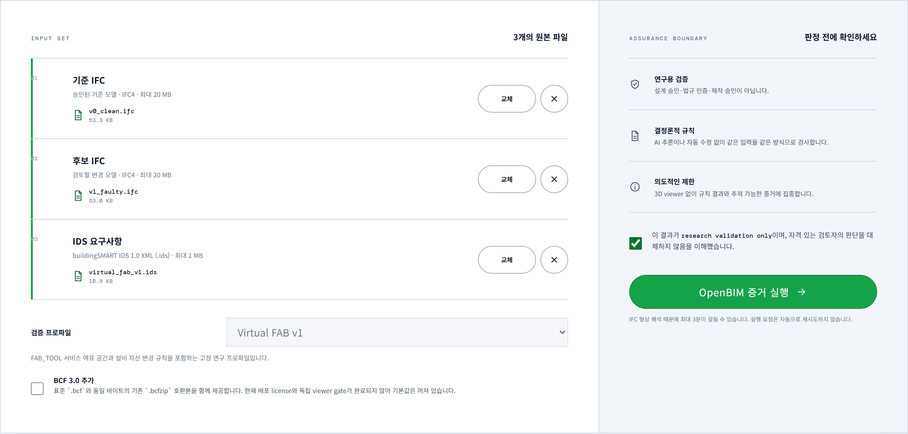
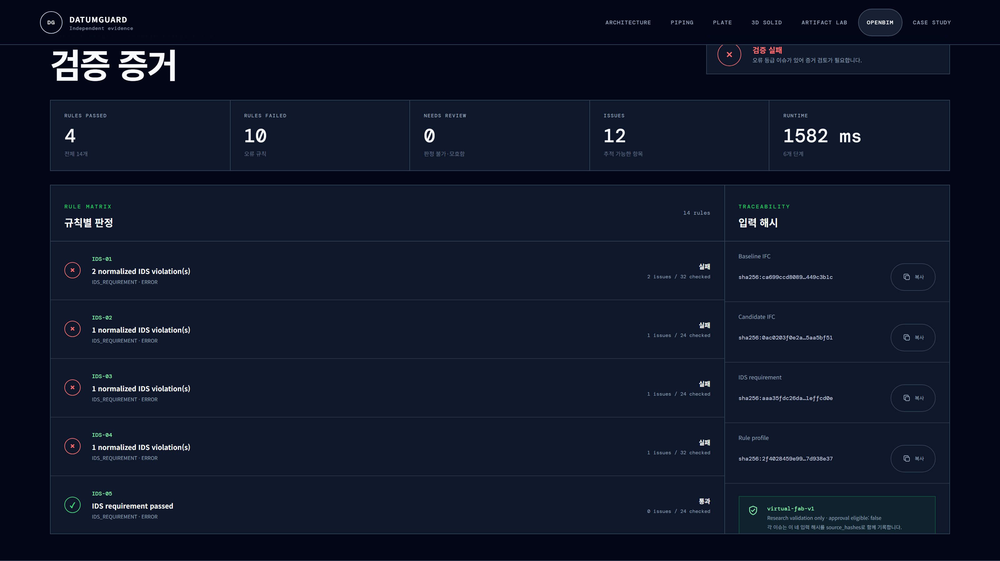

# BIM Awards 2026 학생부 Research 출품 설명서 원고

> 공식 적용: 별표 2-1, 3매 이내, 10 pt, 줄 간격 160%
>
> 제출 전 교체: `[학교명]`, `[학과명]`, `[학년]`, `[성명]`
>
> 패널과 참가증에서도 아래 Core title을 동일하게 사용한다.

## 기본 정보

| 항목 | 내용 |
|---|---|
| 부문·분야 | 학생 / Research |
| 소속 | [학교명] [학과명] |
| 참가자 | [학년] [성명] |
| 국문 제목 | OpenBIM Evidence Guard: IDS 기반 가상 FAB Utility IFC의 정보요구조건 및 리비전 무결성 독립 재검증 연구 |
| 영문 제목 | OpenBIM Evidence Guard: Independent Revalidation of IDS-Based Information Requirements and Revision Integrity for Virtual FAB Utility IFC Models |
| 주요 BIM 적용 방법 | IFC4 artifact 재개방, IDS 1.0 정보요구검사, IFC 무결성 검사, 프로젝트 리비전 계약 검사, 제한형 AABB 여유공간 screening, hash 기반 evidence 생성 |
| 주요 활용 BIM 도구 | IFC4, IfcOpenShell 0.8.5, IfcTester 0.8.5, Python/FastAPI, Next.js, JSON·HTML evidence |
| 연구 대상 | 코드로 생성한 소형 Virtual FAB Utility IFC4 합성 dataset |
| 적용 경계 | 연구용 검증 prototype. 구조·안전·법규·제작·시공 승인이 아님 |

---

## 1쪽. 제출 작품 개요·배경·목적

### 작품 개요

OpenBIM Evidence Guard는 IFC4 기준모델과 수정모델, IDS 1.0 요구조건, 등록된 프로젝트 검증
프로필을 입력받아 저장된 IFC 데이터를 생성 과정과 분리된 worker에서 다시 열고 검사하는 연구용
prototype이다. IFC 구조·식별자, IDS 정보요구조건, 프로젝트별 제한형 여유공간 규칙, 리비전 변경
계약을 서로 다른 검증 범위로 분리한다. 결과는 규칙 ID, 관련 객체, 기대값과 실제값, 입력 파일
SHA-256을 연결한 canonical JSON과 HTML evidence로 남긴다. 본문에서 ‘독립 재검증’은 외부기관
인증이 아니라 저장된 IFC bytes를 별도 프로세스에서 다시 읽는 절차를 뜻한다.

### 작품 배경

BIM 작성 도구에서 IFC 내보내기에 성공했다는 사실만으로 납품 정보요구조건과 변경 이력이
충족됐다고 판단할 수는 없다. 속성이 빠지거나 GlobalId가 중복되고, 승인되지 않은 중요정보 변경이
발생해도 파일은 생성될 수 있다. IDS는 IFC 객체·속성·분류와 같은 정보요구조건을 사람이 읽고
기계가 검사할 수 있게 표현하지만 geometry와 프로젝트별 리비전 계약은 다루지 않는다. BCF도
판정 엔진이 아니라 발생한 이슈를 객체와 연결해 전달·추적하는 형식이다. 본 연구는 표준과
프로젝트 규칙의 역할을 혼합하지 않고 IFC schema, IDS 요구조건, 프로젝트 geometry, 프로젝트
revision을 계층적으로 구분했다.

### 연구 목적과 질문

연구 목적은 실제 FAB 적합성이나 시공 승인을 판정하는 것이 아니다. 가상의 소형 FAB Utility IFC에
사전 정의한 정보·구조·형상·리비전 오류를 주입하고, 결합 파이프라인이 이를 어느 정확도와 시간으로
탐지하며 수정 가능한 증거로 추적하는지를 평가하는 것이다.

---

## 2쪽. BIM 적용의 주안점과 연구 방법

### BIM 적용의 주안점

첫째, scope를 `IFC_SCHEMA`, `IDS_REQUIREMENT`, `PROJECT_GEOMETRY_RULE`,
`PROJECT_REVISION_RULE`로 분리했다. IFC는 schema·project·단위·GlobalId·containment, IDS는 필수
속성과 분류를 검사한다. geometry는 직교 box의 world AABB로 0.6 m service envelope를 만들고,
revision은 `DG_Identity.AssetKey`로 같은 자산의 GlobalId·locked field 변화를 검사한다. geometry
누락과 identity 모호성은 PASS가 아니라 사람 확인 상태로 남긴다.

둘째, 저장된 IFC bytes를 별도 worker에서 다시 열고 baseline·candidate·IDS·profile의 SHA-256을
판정과 연결했다. 각 issue는 rule ID, entity/STEP ID, field, expected/actual과 source hash를
보존하며, timestamp와 run ID를 제외한 canonical payload의 반복 결정성도 확인했다.

셋째, Design Science Research와 통제 오류주입 평가를 결합했다. 실제 기업 자료가 없는
`virtual-fab-v1`은 대표 1, pilot 6, held-out 30의 총 37 case와 32·40·48개 자산 layout으로
구성했다. 각 case에는 clean·authorized·faulty·corrected revision과 독립 manifest·truth가 있고,
faulty candidate마다 11개 오류를 주입해 held-out에서 330개 primary fault를 평가했다.

### 실험 통제와 비교 조건

generator·detector·manifest·evaluator와 pilot/evaluation seed를 분리했다. 규칙·seed·matching
key·metric·threshold는 `protocol-v1`로 사전 동결했고, 저장 IFC를 새 프로세스에서 열어 hash를
보존하며 candidate마다 warm-up 후 10회 측정했다.

330개 고정 분모의 ablation recall은 IDS(A) 0.454545 → +IFC(B) 0.636364 → +geometry(C)
0.818182 → +revision(D) 1.000000으로, 각 scope의 추가 기여는 `+0.181818`이었다.

---

## 3쪽. 결과·연구 기여·한계

### 핵심 결과

합성 held-out 30 case, 120 candidate record와 1,200회 측정 실행에서 engine error는 0건이었다.
Full pipeline은 합성 primary fault 330건에 대해 TP/FP/FN `330/0/0`, precision·recall·F1
`1.000/1.000/1.000`을 기록했다. clean·authorized control의 false positive는 각각 0건이며,
corrected candidate의 신규 issue도 0건이었다. 120/120 candidate에서 canonical payload가 10/10
동일했고 engine runtime median/p95는 1,272.713/1,876.222 ms였다. Primary issue 330건은
source hash, rule ID와 entity reference를 각각 330/330 보존했다.

이 수치는 정해진 generator, object profile과 fault catalog 안의 결과다. 임의의 학생 설계 IFC나
산업 IFC에 대한 정확도 100%를 뜻하지 않는다. 사전등록 목표 중 geometry F1, clean·authorized
false positive, runtime은 PASS였지만 Information·Revision supported-rule macro-F1은 zero-support
정책 미동결로 사후 민감도 분석이며 해당 가설은 `NOT_CONCLUSIVE`로 유지했다.

### 연구 기여와 검증 태도

본 연구는 IFC·IDS·프로젝트 규칙·issue 전달의 책임을 분리하고, 저장된 IFC를 별도 worker에서
재개방해 입력과 판정을 hash로 연결했다. 또한 오류주입 protocol, held-out dataset, ablation과
raw result를 공개했다. 최초 evaluator의 GEO-01 pair key와 ablation denominator 오류로 계산된
`326/4/4`도 숨기지 않았다. Detector와 입력을 재실행하지 않고 보존 raw를 사전 정의에 맞게
재집계해 `330/0/0`을 얻었으며 전·후 수치와 correction audit를 함께 남겼다.

### 적용 한계와 후속 검증

본 연구는 box geometry, 직교 회전, 최대 48개 자산과 교육용 `DG_*` property에 한정된다.
AABB는 exact solid clash가 아니다. 실제 학생 설계, 사람 대상 사용성, 실제 FAB·구조·안전·법규·
제작·시공 적합성은 검증하지 않았다. 공개 production의 OpenBIM은 비활성이고, BCF 3.0 graphical
viewer와 배포 license gate가 끝나지 않아 BCF도 핵심 성과에서 제외했다.

따라서 현재 성과는 **통제된 합성 IFC에서 재현성과 결함 검출 가능성을 평가한 학생 연구
prototype**으로 정의한다. 후속 연구는 zero-coverage PASS를 차단하고 건축 studio용
profile·IDS·속성 mapping을 제공한 뒤 실제 학생 IFC를 별도 pilot으로 평가한다.

### AI 사용 고지

Codex는 범위 정리, test scaffolding과 코드·문서 검토를 보조했다. LLM은 IFC 판정, ground truth
생성과 지표 계산에 사용하지 않았다. 학생은 제출 전 raw result와 최종 결론을 직접 검토한다.
