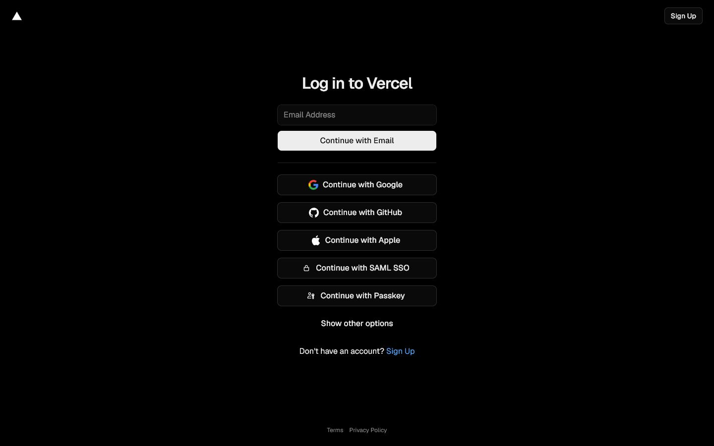
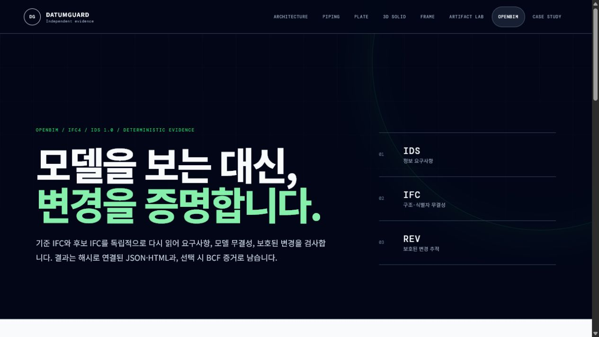
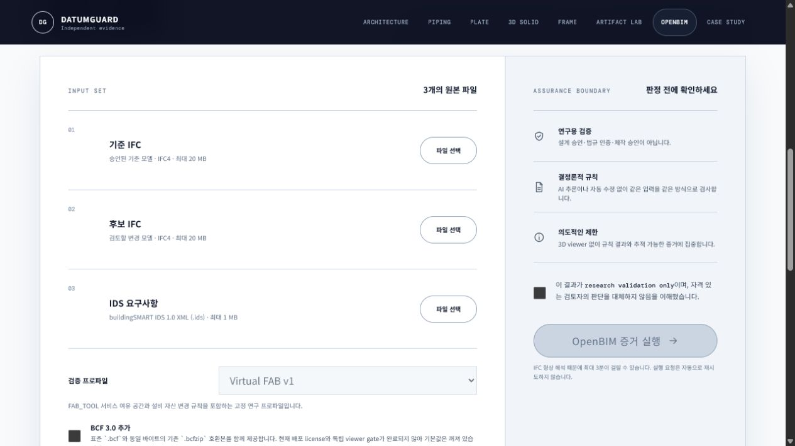
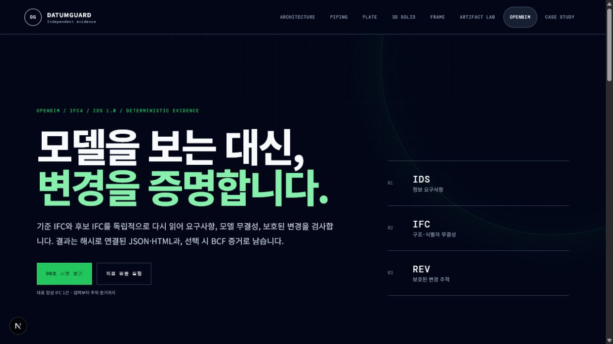
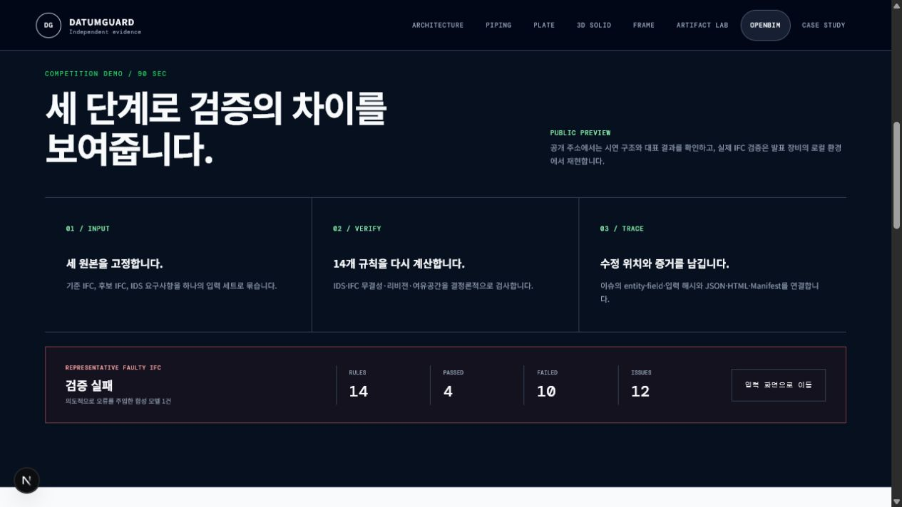
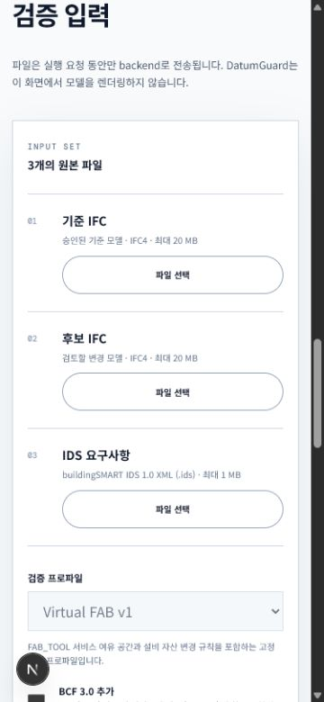

# OpenBIM competition demo design audit

- Audit date: 2026-07-13
- Surface: `/openbim`
- User goal: a judge should understand input, deterministic validation, traceable evidence, and the next review action in about 90 seconds.
- Accessibility target: keyboard-operable, readable at 375 px, and honest about the hosted execution boundary.

## Flow evidence

### 1. Branch preview access — blocked

The PR preview redirects an unauthenticated visitor to Vercel login. This is a P0 shareability blocker for an external judge. The public production alias is accessible, but it does not contain this branch's new design until the branch is promoted or deployed to an explicitly selected public target.

### 2. Existing first screen — usable but passive

Strength: the dark technical identity, Korean display hierarchy, and IDS/IFC/REV scope are distinctive and consistent.

Risk: there is no visible next action or demonstration route above the fold. A judge can understand the premise but cannot tell how to begin or what the demonstration will prove.

### 3. Existing input step — clear fields, unclear readiness

Strength: the three required files and the research-only boundary are explicit.

Risk: the disabled primary button does not explain which prerequisite remains. The hosted execution limitation also appears too late to prevent an external visitor from expecting a runnable cloud demo.

### 4. Improved first screen and 90-second route — healthy

The first screen now offers a primary `90초 시연 보기` route and a secondary direct-run route. The demo section explains the three-step story and distinguishes one representative synthetic faulty IFC result from aggregate research claims. It also states that the public address is a preview while actual IFC execution is reproduced locally.

### 5. Improved input readiness and responsive flow — healthy

The disabled action is now paired with `FILES READY` and `BOUNDARY` indicators. At 375 px the layout reports no horizontal overflow, primary links remain reachable, and the input controls retain full-width tap targets.

## Findings and disposition

1. **P0 — protected preview URL:** unresolved at the hosting layer. The public production URL is usable now; publishing this branch publicly still requires the user to choose a deployment target or promote the branch.
2. **P1 — no judge-oriented entry action:** fixed with two above-the-fold routes.
3. **P1 — no compact demonstration narrative:** fixed with a 90-second INPUT/VERIFY/TRACE section and representative result strip.
4. **P2 — disabled action has no readiness explanation:** fixed with live file and assurance-boundary status.
5. **P2 — result state lacks an immediate next action:** fixed in the result component with a concise `NEXT REVIEW` instruction.
6. **P2 — shared navigation omitted the existing Frame workspace:** fixed so the improved screen matches the public product navigation and keeps `/frame` discoverable.

## Accessibility evidence and limits

- Confirmed from the rendered DOM: semantic headings, ordered demo steps, definition-list metrics, labels for file inputs, visible focus styling in the existing design system, and explicit live readiness text.
- Confirmed visually: no horizontal overflow at 375 px, full-width mobile controls, and no clipped demo content at the checked desktop and mobile states.
- Not proven by screenshots alone: screen-reader announcements across every result mutation, exact WCAG contrast ratios, and the native file-picker flow. Those require separate assistive-technology and keyboard testing.
