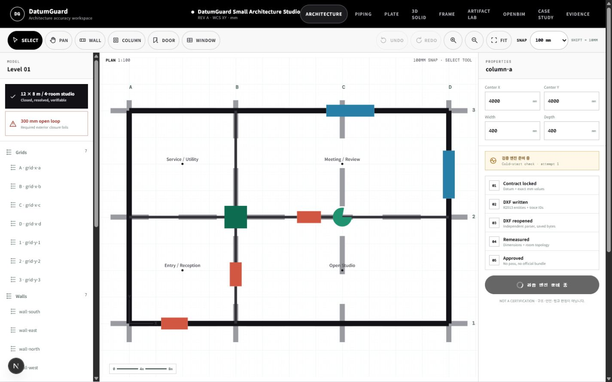
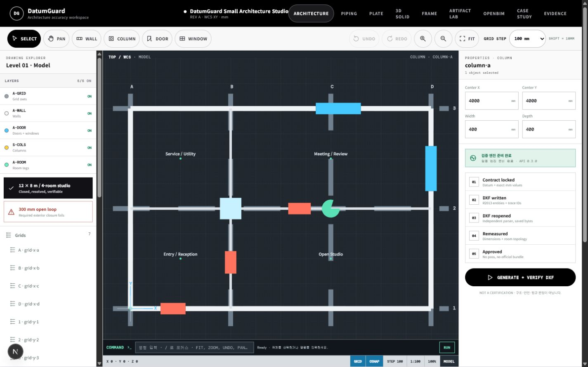
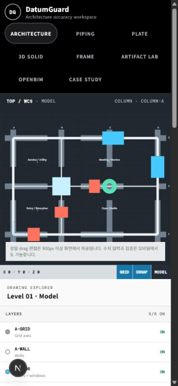

# AutoCAD-style architecture workspace audit

## General health

Passed. The primary student workflow is legible, usable, and honest about product scope: inspect a sample plan, make exact edits, control visible drawing information, and generate only independently verified DXF evidence.

## 1. Source capture

Health before the change: functional but visually closer to a white dashboard than a drafting surface. Grid, selection, snap, and coordinates were not presented as one coherent CAD state. Layer visibility and command input were absent.

## 2. Implemented workspace

Health after the change: the canvas is now the dominant model space, with high-contrast geometry, layer-colored openings/columns/room tags, selected-object metadata, and CAD status controls anchored to the drawing rather than scattered across panels.

## 3. Interaction findings

1. Layer manager — passed. Five real visibility controls change rendered SVG geometry and expose ON/OFF state.
2. Object snap — passed. OSNAP changes the actual drag quantization path; Shift continues to provide 10 mm fine control.
3. Command line — passed. Supported commands execute real view, history, tool, grid, and snap actions; unsupported commands return the supported-command list.
4. Coordinates and crosshair — passed. Pointer movement updates WCS coordinates and the model-space crosshair.
5. Selection and properties — passed. The canvas header and properties panel expose entity type, id, count, and exact millimeter fields.
6. Verification boundary — passed. The five-stage DXF write/reopen/remeasure/approval gate remains unchanged and visible.

## 4. Responsive review

At 375 × 812 the canvas remains first, model-space status remains visible, and layer/numeric controls follow below. The desktop-only command strip and nonessential toolbar are removed to avoid compressing the drawing. No horizontal page overflow was detected.

## 5. Remaining product boundary

P3 only: DatumGuard is not a full AutoCAD/DWG authoring environment. The competition demo should describe it as a CAD-style exact-edit and verification workspace, with native drafting remaining a future integration surface.
