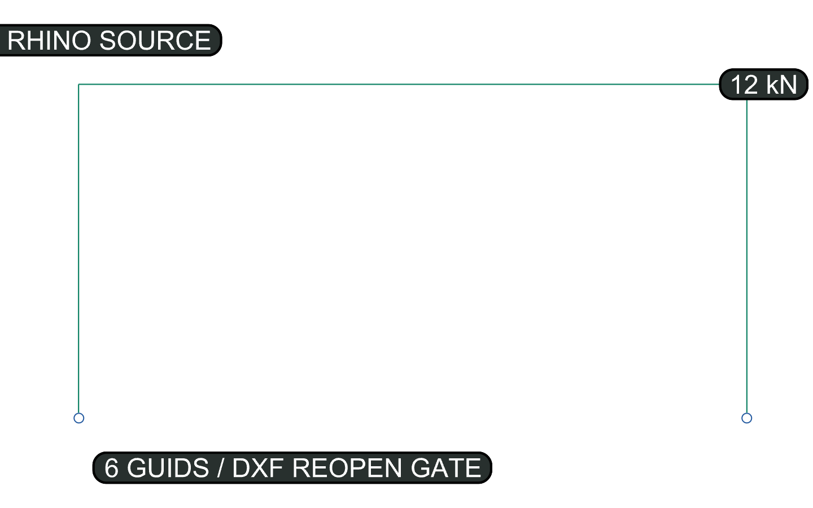

# FrameGuard Rhino·Grasshopper 교환 및 DXF 검증

FrameGuard의 Rhino 연동은 Rhino를 공식 판정 엔진으로 사용하지 않는다. Rhino와 Grasshopper는
직선 centerline, support, load, section metadata를 `RhinoFrameExchange 1.0.0` JSON으로
추출한다. DatumGuard는 이 중립 파일을 mm 좌표의 `StructuralFrameContract`로 정규화하고,
독립 solver와 DXF 재개봉 검증이 완료된 경우에만 PASS를 반환한다.

## 2026-07-13 실제 Cordyceps round-trip evidence

Rhino 8과 Grasshopper의 활성 캔버스를 Cordyceps로 제어해 3개 member, 2개 support,
1개 load를 실제 Rhino document에 만들었다. Grasshopper Python3 component가 Rhino가 발급한
6개 object GUID와 UserString을 읽었고, 한 번의 DatumGuard round-trip이 다음 단계를 모두 수행했다.

```text
Rhino object + UserString
  -> Grasshopper RhinoFrameExchange
  -> exact exchange SHA-256 + normalized contract
  -> deterministic frame screening
  -> R2013/mm DXF write
  -> independent DXF reopen + semantic/provenance check
  -> geometry_evidence ZIP
```



재현 가능한 원본과 결과는 `docs/evidence/`에 고정한다.

| 파일 | 역할 |
|---|---|
| `frameguard-rhino-roundtrip.gh` | Cordyceps가 구성한 재사용 가능한 Grasshopper document |
| `frameguard-rhino-exchange.json` | 실제 Rhino GUID 6개를 포함한 source exchange |
| `frameguard-rhino-roundtrip.dxf` | 직렬화 후 독립 재개봉된 R2013/mm DXF |
| `frameguard-rhino-roundtrip-result.json` | measurement, violation, manifest, GUID mapping |
| `frameguard-rhino-roundtrip.zip` | source, contract, DXF, verification, SVG evidence bundle |
| `frameguard-cordyceps-session.json` | Cordyceps health, component, capture와 gate session record |

현재 고정 evidence의 `exchange_hash`는
`sha256:f82b99229d326f35298b0b06ee6eab010fe32403ab636e3cd479e009d49e4970`,
`artifact_hash`는
`sha256:a9ce6ad6556a2d59c09945deaefef1965b430110a9d55d5d67e2775b6a3d718c`다.
검증 결과는 `provenance_complete=true`, `provenance_verified=true`,
`contract_record_verified=true`, 최대 endpoint 편차 `0.0 mm`다. manifest의 역할은
`geometry_evidence`이며 `safety_certification=false`, `construction_approval=false`다.

재현 명령:

```bash
python tools/capture_frameguard_cordyceps_evidence.py
```

실행 전 Rhino 8, Grasshopper, 활성 canvas의 Cordyceps component와
`http://127.0.0.1:26929/health`를 확인한다. component source는
`integrations/grasshopper/frameguard_cordyceps_exchange_component.py`다. 이 로컬 도구만
Rhino document를 변경하며 public API는 arbitrary RhinoScript, C# 또는 shell 입력을 받지 않는다.

## 정확성 경계

- Rhino document unit은 `mm`, `cm`, `m`, `in`, `ft` 중 하나여야 한다.
- unit이 unset 또는 unknown이면 값을 추정하지 않고 `needs_confirmation`을 반환한다.
- datum은 오른손 직교 단위축이어야 하며 World XY와 평행해야 한다. XY 내부 회전은 지원한다.
- 모든 centerline·support·load는 datum의 XY plane에서 최대 `0.001 mm` 안에 있어야 한다.
- canonical 좌표는 `0.001 mm` 격자로 양자화한다.
- 서로 다른 점이 같은 격자로 양자화되더라도 자동으로 합치지 않는다.
- node 병합은 exchange의 명시적 `node_merge_tolerance` 안에서만 수행한다.
- 곡선, polycurve, arc는 MVP의 구조 member로 받지 않는다. 하나의 직선 curve만 허용한다.
- 이 기능은 2D 선형탄성 screening이며 구조 안전 인증이나 설계기준 판정이 아니다.

## `RhinoFrameExchange 1.0.0`

공개 Pydantic schema는 `src/datumguard/frame_rhino_adapter.py`의
`RhinoFrameExchange`다. 완전한 inch 예시는
`fixtures/examples/frame_rhino_exchange.json`에 있다.

```json
{
  "schema_version": "1.0.0",
  "design_kind": "structural_frame_exchange",
  "document": {
    "document_id": "rhino-doc-guid",
    "units": "mm",
    "datum": {
      "origin": [0.0, 0.0, 0.0],
      "x_axis": [1.0, 0.0, 0.0],
      "y_axis": [0.0, 1.0, 0.0],
      "z_axis": [0.0, 0.0, 1.0]
    }
  },
  "sections": [
    {
      "id": "W310",
      "area": 9300.0,
      "inertia": 182000000.0,
      "depth": 310.0,
      "elastic_modulus_mpa": 200000.0,
      "allowable_stress_mpa": 165.0
    }
  ],
  "members": [
    {
      "id": "M-001",
      "start": [0.0, 0.0, 0.0],
      "end": [0.0, 4000.0, 0.0],
      "section_id": "W310",
      "locked": true
    }
  ],
  "supports": [
    {"id": "S-001", "point": [0.0, 0.0, 0.0], "ux": true, "uy": true, "rz": true}
  ],
  "loads": [
    {
      "id": "L-001",
      "point": [0.0, 4000.0, 0.0],
      "fx_n": 1000.0,
      "fy_n": -10000.0,
      "mz_n_document_unit": 0.0
    }
  ],
  "limits": {"max_displacement": 20.0, "allowable_stress_mpa": 165.0},
  "metadata": {"project_name": "Frame Demo", "revision": "A"},
  "node_merge_tolerance": 0.0
}
```

`area`, `inertia`, `depth`, `max_displacement`, `node_merge_tolerance` 및
`mz_n_document_unit`의 길이 차원은 Rhino document unit을 따른다. force는 N,
elastic modulus와 stress는 MPa다. 예를 들어 inch 문서의 `area=10`은
`6451.6 mm²`, `mz_n_document_unit=2`는 `50.8 N·mm`로 변환된다.

## Rhino 8 사용법

`integrations/rhino/extract_frameguard_exchange.py`를 Rhino Python 3에서 실행한다.
선택 객체만 내보내거나 문서의 모든 tagged 객체를 내보낼 수 있다.

Rhino object Attribute UserStrings:

| 객체 | 필수 값 | 선택 값 |
|---|---|---|
| 공통 | `DG_ENTITY=member/support/load` | `DG_ID` |
| member 직선 curve | `DG_SECTION_ID`, `DG_AREA`, `DG_INERTIA`, `DG_DEPTH`, `DG_ALLOWABLE_MPA` | `DG_E_MPA`, `DG_LOCKED` |
| support point | `DG_UX`, `DG_UY`, `DG_RZ` | 없음 |
| load point | `DG_FX_N`, `DG_FY_N`, `DG_MZ_N_UNIT` | 없음 |

Rhino document UserStrings:

| 키 | 설명 |
|---|---|
| `DG_MAX_DISPLACEMENT` | document unit 기준 허용 변위, 필수 |
| `DG_ALLOWABLE_STRESS_MPA` | MPa 기준 허용응력, 필수 |
| `DG_NODE_MERGE_TOLERANCE` | 명시적 node 병합거리, 기본 0 |
| `DG_PROJECT_NAME` | 프로젝트명 |
| `DG_REVISION` | revision, 기본 A |
| `DG_NOTES` | 계약 note |

script는 active viewport construction plane을 datum으로 기록한다. 유효하지 않은 단위,
비직선 curve, 누락 section 속성 또는 서로 충돌하는 동일 section metadata가 있으면 JSON을
생성하지 않는다.

## Grasshopper 사용법

`integrations/grasshopper/frameguard_exchange_component.py`의 내용을 Rhino 8 Grasshopper
Python 3 component에 붙여 넣는다. 입력은 `Curves`, `Supports`, `Loads`, `Sections`,
`DocumentUnits`, `Datum`, `Limits`, `Metadata`, `NodeMergeTolerance`다. 출력은
`ExchangeJSON`과 `Messages`다.

curve, support, load 항목은 geometry 자체 또는 다음과 같은 dictionary일 수 있다.

```python
{
    "geometry": curve,
    "id": "M-001",
    "section_id": "W310",
    "locked": True
}
```

component 결과가 `READY`여도 아직 구조 PASS가 아니다. 서버의 adapter, solver, DXF verifier
단계를 모두 통과해야 한다.

## Python application service 사용

한 번의 provenance-bound 실행은 HTTP `POST /api/v1/frame/rhino/roundtrip` 또는 MCP
`frame_rhino_roundtrip`을 사용한다. 성공 응답에는 `exchange_hash`, `contract_hash`,
`artifact_hash`, `verification`, `manifest`, `dxf_base64`, `bundle_base64`가 함께 있다.
source mapping, exact solver, DXF reopen 중 하나라도 실패하면 bundle은 생성되지 않는다.

```python
import json
from pathlib import Path

from datumguard.frame_dxf import generate_frame_dxf, verify_frame_dxf
from datumguard.frame_rhino_adapter import adapt_rhino_frame_exchange

payload = json.loads(Path("frame-exchange.json").read_text(encoding="utf-8"))
adapted = adapt_rhino_frame_exchange(payload)
if adapted.status.value != "ready" or adapted.structural_contract is None:
    raise RuntimeError([item.model_dump() for item in adapted.violations])

dxf_bytes = generate_frame_dxf(adapted.structural_contract)  # generated-unverified
verification = verify_frame_dxf(adapted.structural_contract, dxf_bytes)
if verification.status.value != "passed":
    raise RuntimeError([item.model_dump() for item in verification.violations])
```

## DXF evidence contract

writer는 R2013, `$INSUNITS=mm` DXF를 생성한다.

- `S-FRAME`: member `LINE`
- `S-SUPP`: support `POINT`
- `S-LOAD`: load `POINT`
- `DG-META`: screening notice `TEXT`

모든 entity에는 `DATUMGUARD` XDATA가 있다.

- `contract_hash`
- `entity_id`
- `entity_type`
- `revision`
- `datum=origin:0,0,0;x:1,0,0;y:0,1,0;z:0,0,1`
- `unit=mm`
- `design_kind=structural_frame`
- `source_object_id=<Rhino GUID>`
- member section/material/locked, support restraint, load semantic record

DXF root dictionary에는 canonical `StructuralFrameContract` 전체를 base64 chunked XRECORD로
기록한다. verifier는 이 record를 다시 조립해 contract와 exact compare한다. modelspace 밖의
entity, user block definition, 예상하지 않은 layer/entity도 fail-closed다.

독립 verifier는 serialized bytes를 ezdxf로 다시 열어 version, INSUNITS, layer, XDATA,
entity count, member endpoint, support/load point, Z deviation 및 duplicate centerline을
재검사한다. 최대 편차는 `0.001 mm`다. endpoint나 XDATA가 변조되면
`failed_verification`이며 official PASS는 생성되지 않는다.

## 주요 오류코드

| 코드 | 의미 |
|---|---|
| `DG_FRAME_RHINO_UNIT_CONFIRMATION_REQUIRED` | 지원 단위가 명시되지 않음 |
| `DG_FRAME_RHINO_DATUM_NONORTHONORMAL` | datum 축이 직교 단위축이 아님 |
| `DG_FRAME_RHINO_DATUM_NOT_XY` | datum이 World XY와 평행하지 않음 |
| `DG_FRAME_RHINO_OUT_OF_PLANE` | 객체가 허용 XY plane 밖에 있음 |
| `DG_FRAME_RHINO_POINT_NOT_ON_NODE` | support/load가 명시 tolerance 내 node와 만나지 않음 |
| `DG_FRAME_RHINO_QUANTIZATION_COLLISION` | 서로 다른 node가 0.001mm 격자에서 충돌함 |
| `DG_FRAME_DXF_INSUNITS_INVALID` | DXF 단위가 mm가 아님 |
| `DG_FRAME_DXF_XDATA_MISSING` | 필수 추적 XDATA 누락 |
| `DG_FRAME_DXF_DATUM_MISMATCH` | normalized datum XDATA 변조 또는 불일치 |
| `DG_FRAME_DXF_ENDPOINT_DEVIATION` | member endpoint 편차가 0.001mm 초과 |
| `DG_FRAME_DXF_DUPLICATE_GEOMETRY` | 중복 member centerline 존재 |
| `DG_FRAME_DXF_PROVENANCE_MISMATCH` | Rhino GUID와 entity mapping이 source manifest와 다름 |
| `DG_FRAME_DXF_SEMANTIC_MISMATCH` | section, restraint 또는 load 의미 레코드가 다름 |
| `DG_FRAME_DXF_CONTRACT_RECORD_MISMATCH` | DXF 내부 contract XRECORD가 원본 contract와 다름 |
| `DG_FRAME_DXF_PAPERSPACE_CONTENT_FORBIDDEN` | 허용되지 않은 paperspace entity 존재 |
| `DG_FRAME_DXF_USER_BLOCK_FORBIDDEN` | 허용되지 않은 사용자 block definition 존재 |

## 검증

```bash
uv run --extra dev pytest \
  tests/test_frame_rhino_adapter.py tests/test_frame_dxf.py \
  tests/test_frame_rhino_roundtrip.py tests/test_frame_assurance_api.py tests/test_frame_mcp.py
uv run --extra dev ruff check \
  src/datumguard/frame_rhino_adapter.py src/datumguard/frame_dxf.py \
  tests/test_frame_rhino_adapter.py tests/test_frame_dxf.py
uv run --extra dev mypy --config-file pyproject.toml \
  src/datumguard/frame_rhino_adapter.py src/datumguard/frame_dxf.py
```

repository test는 RhinoCommon을 import하지 않는다. Rhino와 Grasshopper script는 integration
경계에만 있어 CI와 public backend가 Rhino 설치에 의존하지 않는다.
