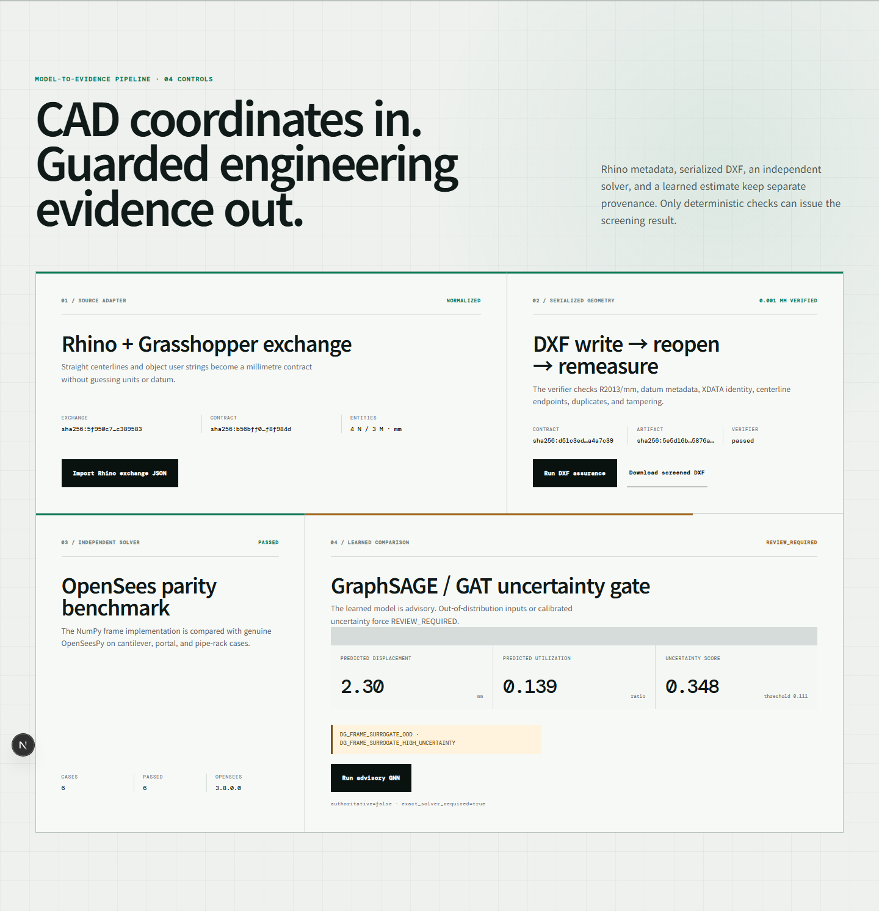

# FrameGuard: 결정론적 구조 프레임 스크리닝

> FrameGuard는 공학 검토 우선순위를 정하는 screening 도구다. 구조 안전, 법규 적합성,
> 제작·시공·운영 적합성을 인증하지 않는다. 해석 모델, 하중, 하중조합, 허용 기준과 최종
> 판단은 자격을 갖춘 구조 엔지니어가 결정해야 한다.



위 이미지는 실제 API interaction을 캡처한 시현 evidence다. `/frame`과 assurance API는 v0.3.0
Vercel/Render production에 배포되었고, exact release SHA·capability·canary·CORS는
[strict smoke 29195107475](https://github.com/tjwnsdhfz/datumguard/actions/runs/29195107475)에서
검증됐다. 이 배포 사실은 구조 안전 인증을 의미하지 않는다.

## 1. PRD-lite

### 문제

초기 프레임 설계는 CAD 선, Rhino curve 또는 spreadsheet로 자주 전달된다. 이 표현만으로는
끊어진 부재, 구속되지 않은 자유도, 과도한 변위와 위험 부재를 놓치기 쉽다. 또한 단일
`stable/unsafe` 확률만으로는 설계 검토에 부족하다. 사용자는 어떤 node/member가 지배하는지,
계산값과 허용값은 무엇인지, 같은 입력을 재현할 수 있는지를 확인해야 한다.

### 제품 약속

FrameGuard는 명시적인 `StructuralFrameContract`를 결정론적 2D 해석 모델로 변환하고,
지배 node/member, 변위 형상과 추적 가능한 evidence를 반환한다. 선언된 자유 단면 파라미터에
대해서만 제한된 변경안을 제안할 수 있으며 topology, load, support 또는 locked member는
변경하지 않는다.

### 초기 사용자와 대표 데모

- 하중 경로와 프레임 거동을 학습하는 공학 학습자·메이커
- 전문 구조 검토 전에 모델 품질과 위험 후보를 빠르게 확인하려는 CAD·Rhino 사용자
- 플랜트, 반도체 시설, 조선·산업설계 직무의 포트폴리오 검토자

대표 데모는 2D semiconductor utility pipe rack이다. 정상 preset은 연결·구속된 프레임이
선언된 기준을 통과하는 과정을 보여준다. 실패 preset은 지배 violation과 측정 evidence를
표시하고 `PASS` 주장을 차단한다.

### 기능 요구사항

| ID | 요구사항 |
|---|---|
| `DG-FRAME-FR-001` | mm/N/MPa 단위의 명시적이고 versioned된 `StructuralFrameContract`만 입력받는다. |
| `DG-FRAME-FR-002` | 중복 ID, 끊어진 reference, 길이 0 부재, 잘못된 물성, 불안정·비연결 모델을 stable error code로 차단한다. |
| `DG-FRAME-FR-003` | 결정론적 선형탄성 2D frame 해석으로 node displacement와 member demand evidence를 반환한다. |
| `DG-FRAME-FR-004` | 사용자가 선언한 변위·응력 limit만 검사하고 code compliance를 주장하지 않는다. |
| `DG-FRAME-FR-005` | 공개 결과에 `contract_hash`, `artifact_hash`, `status`, `measurements`, `violations`, `evidence`를 포함한다. |
| `DG-FRAME-FR-006` | 지배 node/member와 원형상·변형 형상의 SVG preview를 제공한다. |
| `DG-FRAME-FR-007` | 선언된 자유 단면 파라미터만 수정하며 topology, support, load, locked member를 수정하지 않는다. |
| `DG-FRAME-FR-008` | 동일 application service를 FastAPI·MCP로 제공하고 `design_kind`가 없는 plate 입력의 하위 호환을 유지한다. |
| `DG-FRAME-FR-009` | UI·API·MCP·문서에서 결과를 구조 안전 인증이 아닌 screening evidence로 표시한다. |
| `DG-FRAME-FR-010` | AI surrogate를 승인 경계 밖에 두며 결정론적 solver evidence를 공식 근거로 유지한다. |
| `DG-FRAME-FR-011` | Rhino/GH exchange는 centerline·support·load·section과 명시적 document unit/datum만 contract로 변환한다. |
| `DG-FRAME-FR-012` | R2013/mm DXF를 별도 reader가 다시 열어 좌표·단위·datum을 `0.001 mm` gate로 검증한다. |
| `DG-FRAME-FR-013` | 공식 solver를 genuine OpenSeesPy 3.8과 고정 parity suite에서 비교하고 불일치를 fail-closed한다. |
| `DG-FRAME-FR-014` | solver-labeled 90-case topology holdout에서 실제 PyG GraphSAGE/GAT를 같은 split으로 비교한다. |
| `DG-FRAME-FR-015` | surrogate는 `PREDICTED` 또는 `REVIEW_REQUIRED`만 반환하며 OOD·고불확실성·artifact 오류를 후자로 차단한다. |
| `DG-FRAME-FR-016` | surrogate와 OpenSees evidence는 공식 PASS source가 아니며 exact solver와 DXF gate를 우회하지 않는다. |
| `DG-FRAME-FR-017` | assurance schema·adapter·CAD·surrogate·benchmark를 HTTP와 4개 전용 MCP tool로 공개한다. |
| `DG-FRAME-FR-018` | `/frame` 배포는 web/API/domain/canary smoke가 같은 release SHA에서 통과한 뒤에만 완료로 표시한다. |

### MVP 성공 기준

- 같은 canonical contract의 hash와 수치 결과가 반복 실행에서 동일하다.
- 모든 결과 node/member reference가 제출된 contract의 ID로 해석된다.
- invalid 또는 singular model은 절대 `passed`를 반환하지 않는다.
- 자동 repair가 변경한 locked parameter는 0건이다.
- 어떤 결과도 code-compliant 또는 construction-approved로 표현하지 않는다.
- PASS·FAIL fixture를 API와 MCP 통합 테스트에서 실행한다.

### 범위

포함:

- 단일 평면·단일 해석 case의 2D frame screening
- node, beam-column member, nodal load, 명시적 support
- 선형탄성 displacement와 member stress 검사
- contract validation, deterministic hash, evidence timeline, SVG preview
- 선언된 free parameter에 대한 bounded section-property repair proposal

제외:

- 구조설계 인증 또는 국가·산업 code 적합성
- 3D, 2차효과, 재료·기하 비선형, 소성, 좌굴, 피로, 파괴, 지진·풍 스펙트럼,
  화재, 지반-구조 상호작용, 연쇄붕괴
- 접합부, 용접, bolt, anchor, baseplate, local plate, equipment nozzle 설계
- 자동 하중 산정, 하중조합, 안전계수 또는 재료 선택
- 제작·설치·운영 허가에 해당하는 산출물

## 2. 공개 contract

`GET /api/v1/schema/frame-contract`가 source of truth다. 아래는 top-level 형태의 예시이며,
필수 field와 수치 제약은 실행 중 생성되는 JSON Schema를 따른다.

```json
{
  "schema_version": "1.0.0",
  "design_kind": "structural_frame",
  "units": "mm",
  "nodes": [
    {"id": "N1", "point": [0.0, 0.0], "locked": true}
  ],
  "members": [
    {
      "id": "M1",
      "start_node_id": "N1",
      "end_node_id": "N2",
      "area_mm2": 6000.0,
      "inertia_mm4": 80000000.0,
      "elastic_modulus_mpa": 200000.0,
      "section_depth_mm": 300.0,
      "locked": false
    }
  ],
  "loads": [
    {"id": "L1", "node_id": "N2", "fx_n": 0.0, "fy_n": -25000.0, "mz_nmm": 0.0}
  ],
  "supports": [
    {"id": "S1", "node_id": "N1", "ux": true, "uy": true, "rz": true}
  ],
  "limits": {
    "max_displacement_mm": 20.0,
    "allowable_stress_mpa": 150.0
  },
  "free_parameters": [
    {
      "id": "FP-M1-A",
      "path": "members.M1.area_mm2",
      "minimum": 6000.0,
      "maximum": 12000.0,
      "step": 500.0,
      "unit": "mm2"
    }
  ],
  "metadata": {"project_name": "Utility pipe rack", "revision": "A"},
  "contract_hash": null
}
```

실행 가능한 예제는 다음 fixture다.

- `fixtures/examples/frame_pipe_rack.json`: screening PASS 기대값
- `fixtures/examples/frame_pipe_rack_failure.json`: screening FAIL 기대값

호출자가 공학 입력을 직접 제공해야 한다. FrameGuard는 자연어나 CAD image에서 누락된 geometry,
section property, restraint, load 또는 limit을 추정하지 않는다.

## 3. 해석 구조와 가정

```text
StructuralFrameContract
        │
        ├── canonical validation ──> contract_hash
        │
        └── deterministic 2D solver
                ├── node displacement evidence
                ├── member force/stress evidence
                ├── declared-limit gate
                └── SVG displaced-shape preview
                         │
                         ├── passed
                         ├── failed_verification
                         └── infeasible / needs_confirmation
```

MVP solver ID는 `datumguard_numpy_2d_frame_v1`이다. 각 node의 `ux`, `uy`, `rz` 3개 자유도와
Euler-Bernoulli 2D frame element를 dense global stiffness matrix로 조립한다. small-displacement,
linear-elastic 거동과 nodal load를 가정하고 한 member의 property는 길이 방향으로 일정하다.

공개 요청은 dense solver의 CPU 비용을 제한하기 위해 node 120개, member 240개, load와 support
각 120개, free parameter 50개로 제한한다. Frame analysis endpoint는 운영 middleware의 heavy
queue와 stricter rate limit을 사용한다.
허용 limit은 설계 code에서 자동으로 선택하지 않고 contract가 제공한다. solver가 수치적으로
해를 구했다는 사실은 제출된 idealized model에 대한 결과일 뿐이며, model이 실제 구조물을
올바르게 표현한다는 뜻이 아니다.

Evidence boundary는 다음과 같다.

1. Contract validation은 schema와 model reference 일관성을 검사한다.
2. Deterministic solver는 해당 idealized contract의 계산을 재현한다.
3. Gate는 solver 결과를 caller-provided limit과 비교한다.
4. 실제 하중, 경계조건, 재료 성적서, 상세설계 또는 법규 적합성은 검증하지 않는다.

## 4. Repair 정책

`propose_frame_repair`와 MCP repair tool은 제한된 설계 study 도구다.

- 허용: min/max/step이 선언된 free `area_mm2` 또는 `inertia_mm4` path
- 금지: node 좌표, topology, member connectivity, load, support, limit, locked member,
  선언되지 않은 path, 임의 script 실행
- Proposal은 적용된 설계나 approval evidence가 아니다.
- 제안을 반영한 경우 완전한 revised contract를 다시 해석해야 한다.

Response는 정확한 path, before/after value, 근거 violation을 기록해야 하며 프레임을 조용히
최적화해서는 안 된다.

## 5. HTTP API

| Method | Path | 목적 |
|---|---|---|
| `GET` | `/api/v1/schema/frame-contract` | 공개 JSON Schema 생성 |
| `POST` | `/api/v1/frame/contracts/validate` | Canonical validation과 contract hash |
| `POST` | `/api/v1/frame/designs/run?auto_repair=false` | 결정론적 screening analysis |
| `GET` | `/api/v1/schema/rhino-frame-exchange` | Rhino/GH 중립 exchange JSON Schema |
| `POST` | `/api/v1/frame/rhino/adapt` | 명시적 unit/datum을 mm frame contract로 정규화 |
| `POST` | `/api/v1/frame/cad/run` | exact solver와 serialized DXF 독립 재개봉 gate |
| `POST` | `/api/v1/frame/surrogate/predict` | 비공식 GraphSAGE ensemble triage |
| `GET` | `/api/v1/frame/benchmarks/opensees` | 패키지에 고정한 OpenSees parity evidence |
| `GET` | `/api/v1/frame/benchmarks/gnn` | 패키지에 고정한 PyG benchmark evidence |

```bash
curl -sS -X POST \
  "http://127.0.0.1:8000/api/v1/frame/designs/run?auto_repair=false" \
  -H "Content-Type: application/json" \
  --data-binary @fixtures/examples/frame_pipe_rack.json
```

잘못된 입력과 해석 불능 model은 기존 API exception boundary에서 structured `DG_*` 오류로
처리한다. HTTP 200 자체는 안전을 뜻하지 않으며 client는 `status`, `violations`와 disclaimer를
함께 읽어야 한다.

## 6. MCP

### `frame_analyze`

완전한 frame contract와 optional `auto_repair=false`를 입력받는다. 공통 envelope와 summary,
timeline, SVG preview가 포함된 deterministic run response를 반환한다. Agent는 response의
node/member ID와 measurement만 인용하고 안전 결론을 만들어내지 않는다.

### `frame_repair_propose`

완전한 contract를 입력받고 서버가 동일 contract를 다시 해석한 뒤 bounded section change를
제안한다. 사용자가 전달한 analysis 값을 신뢰하지 않는다. 공통 envelope를 유지하고 제안을
적용하거나 approval로 바꾸지 않는다.

Generic `design_contract_draft`와 `design_contract_validate`도
`design_kind="structural_frame"`을 인식한다. `design_kind`가 없으면 기존 plate contract로
dispatch하여 하위 호환을 유지한다.

### Assurance 전용 tool

| Tool | 역할 | 승인 권한 |
|---|---|---|
| `frame_rhino_adapt` | Rhino/GH exchange를 mm contract로 정규화 | 없음 |
| `frame_dxf_generate_verify` | exact solver 후 DXF 생성·재개봉 검증 | 두 gate가 모두 통과할 때 screening artifact만 반환 |
| `frame_surrogate_predict` | 경량 GraphSAGE ensemble preview | 없음; `PASS`를 반환하지 않음 |
| `frame_opensees_parity_evidence` | 고정된 genuine OpenSeesPy parity report 조회 | 없음; 현재 요청의 안전 판정에 사용하지 않음 |

기존 9개 도구와 Artifact/Solid/FrameGuard 도구를 합한 현재 MCP surface는 18개다.

## 7. Demo 흐름

1. 정상 utility pipe-rack fixture의 node, support, member와 nodal load를 확인한다.
2. 해석 후 immutable contract/artifact hash를 표시한다.
3. Evidence panel에서 governing node/member를 선택하고 원형상·변형 형상을 겹쳐 표시한다.
4. 실패 fixture에서 계산값, 선언된 limit과 관련 ID를 함께 보여준다. 설명 없는 red/green
   점수로 축약하지 않는다.
5. 지원되는 free parameter가 있으면 before/after 범위 제안을 요청하고 revised contract를
   별도 실행으로 재검증한다.
6. 마지막에 limitation과 qualified-engineer review 필요성을 다시 표시한다.

## 8. 포트폴리오에서 사용할 수 있는 주장

Code, fixture와 test evidence로 방어할 수 있는 표현:

- “결정론적 hash와 reference validation을 갖춘 versioned 구조 프레임 contract를 설계했다.”
- “black-box 안정성 label 대신 governing node/member evidence를 반환하는 2D screening
  pipeline을 구현했다.”
- “동일 application service를 FastAPI와 MCP로 제공하면서 기존 CAD contract dispatch의
  하위 호환을 유지했다.”
- “Repair를 선언된 section parameter로 제한하고 topology, load, support와 locked member를
  보호했다.”
- “수치 screening과 전문가의 안전·법규 판단 경계를 분리했다.”
- “Rhino/GH geometry를 명시적 unit/datum contract로 변환하고 serialized DXF를 `0.001 mm`
  기준으로 독립 재개봉했다.”
- “genuine OpenSeesPy 3.8과 cantilever·portal·2/3/4-bay·failure fixture 6개를 비교해 6/6
  parity를 통과시켰다.”
- “90-case topology holdout에서 PyG GraphSAGE/GAT를 3-seed ensemble로 비교하고 OOD·불확실성에
  `REVIEW_REQUIRED` gate를 적용했다.”

위 주장은 repository의 versioned JSON evidence 범위에서만 사용한다. 범용 FEA 동등성, 법규 검증,
제작 승인, 실사업장 검증 또는 실제 구조물에서의 GNN 성능은 주장하지 않는다.

## 9. 독립 연구 evidence와 공식 판정 분리

현재 연구 경로는 다음 세 층으로 분리되어 있다.

1. `datumguard_numpy_2d_frame_v1`: 현재 contract의 공식 screening source
2. genuine `openseespy==3.8.0.0`: 동일 선형 범위의 독립 parity evidence
3. PyG GraphSAGE/GAT: exact solver label을 근사하는 비공식 preview research

OpenSees suite는 cantilever, portal, 2/3/4-bay rack과 의도된 FAIL fixture를 genuine engine으로
실행해 6/6 parity `PASSED`를 기록했다. PyG benchmark는 solver-labeled 90 cases 중 4-bay 30개를
완전 holdout했다. 3-seed ensemble의 test 결과는 아래와 같다.

| Model | displacement MAE | displacement R² | utilization MAE | utilization R² |
|---|---:|---:|---:|---:|
| GraphSAGE | `0.627426 mm` | `0.804861` | `0.0371842` | `0.732706` |
| GAT | `0.651228 mm` | `0.792357` | `0.0294386` | `0.806528` |

GraphSAGE 선택은 test 우승 주장이 아니라 NumPy portable inference와 PyG의 결정적 parity 및 base
Docker에서 Torch를 제거하기 위한 선택이다. surrogate는 case ranking 또는 빠른 preview만 담당한다.
모델 누락·손상, invalid input, OOD 또는 validation-derived threshold를 넘는 불확실성은
`REVIEW_REQUIRED`다. AI 출력은 exact solver measurement를 덮어쓰거나 최종 PASS를 만들 수 없다.

- Rhino/GH 및 DXF: [frameguard-rhino.md](frameguard-rhino.md)
- OpenSeesPy 6-case report: [frameguard-opensees.md](frameguard-opensees.md)
- GraphSAGE/GAT metrics와 uncertainty: [frameguard-gnn.md](frameguard-gnn.md)
- 이전 ridge baseline: [frameguard-surrogate.md](frameguard-surrogate.md)

## 10. 검증 명령

```bash
uv run pytest tests/test_frame_api.py tests/test_frame_mcp.py \
  tests/test_frame_rhino_adapter.py tests/test_frame_dxf.py \
  tests/test_frame_cad_service.py tests/test_frame_surrogate.py
uv run ruff check src/datumguard/api.py src/datumguard/mcp_server.py \
  src/datumguard/frame_rhino_adapter.py src/datumguard/frame_dxf.py \
  tests/test_frame_api.py tests/test_frame_mcp.py tests/test_frame_rhino_adapter.py \
  tests/test_frame_dxf.py
```

MCP dispatcher와 FastAPI application을 다른 domain도 공유하므로 release 전에 전체 backend
suite를 실행한다. OpenSeesPy와 PyG는 base runtime이 아닌 선택형 research workflow에서 설치·검증한다.
v0.3.0은 [CI 29194952632](https://github.com/tjwnsdhfz/datumguard/actions/runs/29194952632)의
376 pytest·35 Playwright·container gate와
[research run 29194964854](https://github.com/tjwnsdhfz/datumguard/actions/runs/29194964854)를
통과했으며, 공개 데모는 [Vercel `/frame`](https://datumguard-tjwnsdhfz.vercel.app/frame)에서 조회한다.
